# SQL SKU Performance Testing 2020-02
The goal of the testing performed was to get a first order comparison of varying SQL Server SKUs. The testing was limited to only ingestion of a given set of Synthea patient bundles.

## Setup
All of the tests were performed using the same web application with the same SQL store, but with different SQL SKU options. 

### FHIR server
The FHIR server used was a slightly modified R4 open source variety using the Identity Server for authN/authZ. It was hosted in an App Service that was scaled to two instances of P3v2 (840 total ACU, 14 GB memory, Dv2-Series compute equivalent). 

The following changes were made:
* Disabled sampling in Application Insights
* The SQL schema was updated to use the `OPTIMIZE_FOR_SEQUENTIAL_KEY` hint where appropriate. This was observed to have a slight improvement on ingestion speed.

### FHIR Importer Utility
Load was generated using the `FhirImporter` from the [Fhir Server Samples repository](https://github.com/microsoft/fhir-server-samples). The importer was updated with the addition of custom events to aid with reporting. This was hosted in a container instance using the template in the same repository.

### Data
The data used in the tests were a collection of 1180 R4 Synthea patients. These were imported into a container (named `source`) in the same storage account used by the importer.

### Process
After the initial setup was completed, each test was run in the following manner:
* The SQL server was scaled to the appropriate SKU
* The SQL schema was reset and data deleted from the server
* The import was kicked off with a blob copy command via Azure CLI (`az storage blob copy start-batch --destination-container fhirimport --source-container source`)

## Results
| Name                       | No. of Operations* | min_timestamp             | max_timestamp             | duration | avg     | 50 percentile | 90 percentile | 95 percentile | 99 percentile | 99.9 percentile |
|----------------------------|--------------------|---------------------------|---------------------------|----------|---------|---------------|---------------|---------------|---------------|-----------------|
| 1vCore_Standard_Optimized  | 526,766            | 2/10/2020, 7:06:43.089 PM | 2/10/2020, 8:35:25.037 PM | 1:28:42  | 1366.73 | 1,345.80      | 2,065.78      | 2,284.97      | 2,736.68      | 3,429.16        |
| 2vCore_Standard_Optimized  | 526,304            | 2/18/2020, 7:36:41.123 PM | 2/18/2020, 8:42:34.697 PM | 1:05:54  | 1015.37 | 905.94        | 1688.53       | 1978.91       | 2831.81       | 15733.74        |
| 4vCore_Standard_Optimized  | 527,113            | 2/11/2020, 5:23:26.763 PM | 2/11/2020, 6:01:06.270 PM | 0:37:40  | 541.10  | 438.326       | 991.959       | 1,245.14      | 2,017.86      | 8,121.35        |
| 8vCore_Standard_Standard   | 527,113            | 2/10/2020, 5:03:49.174 PM | 2/10/2020, 5:30:05.892 PM | 0:26:17  | 365.90  | 346.481       | 584.777       | 654.803       | 827.418       | 2,865.71        |
| 8vCore_Standard_Optimized  | 527,113            | 2/10/2020, 4:22:31.498 PM | 2/10/2020, 4:47:41.907 PM | 0:25:10  | 311.86  | 249.698       | 572.486       | 723.1         | 1,114.82      | 2,093.93        |
| 16vCore_Standard_Optimized | 526,613            | 2/11/2020, 6:13:02.333 PM | 2/11/2020, 6:31:21.617 PM | 0:18:19  | 217.30  | 172.041       | 379.156       | 481.325       | 774.135       | 4,758.66        |
| 80vCore_Standard_Optimized | 527,113            | 2/11/2020, 7:05:41.315 PM | 2/11/2020, 7:20:49.988 PM | 0:15:09  | 175.62  | 118.957       | 355.144       | 461.103       | 691.299       | 4,581.55        |
| 1600DTU_Optimized          | 527,113            | 2/10/2020, 6:39:52.294 PM | 2/10/2020, 6:58:45.994 PM | 0:18:54  | 246.75  | 188.514       | 422.017       | 543.045       | 1,071.52      | 5,696.35        |

\* The number of resources inserted is 527,113. For some runs, application insights seemed to be missing some of the custom events. When the database was queried, the correct number of resources existed. The slight difference in number of operations shouldn't have much of a difference on the numbers reported in the table.

#### Queries used
The table above is made of a union of many of the same query below but with different timestamps and titles.
```
customEvents
| where timestamp between( datetime("2020-02-18T14:53:00-0800") .. datetime("2020-02-18T15:30:00-0800")) 
| where name == "Successful resource request" 
| extend SKU = "16vCore_Hyperscale_Optimized", totalMilliseconds = todecimal(customMeasurements.totalMilliseconds), sortKey = 14
| summarize count(), percentiles(totalMilliseconds, 50, 90, 95, 99, 99.9), min(timestamp), max(timestamp), avg(totalMilliseconds) by SKU, sortKey
| project sortKey, SKU, count_, min_timestamp, max_timestamp, duration = max_timestamp - min_timestamp, avg_totalMilliseconds, percentile_totalMilliseconds_50, percentile_totalMilliseconds_90, percentile_totalMilliseconds_95, percentile_totalMilliseconds_99, percentile_totalMilliseconds_99_9 
```

The query for the timecharts below is the following updated for the appropriate timestamp and title:
```
dependencies
| where timestamp between( datetime("2020-02-18T14:53:00-0800") .. datetime("2020-02-18T15:30:00-0800")) 
| summarize avg(duration), Resources_per_sec = count() by bin(timestamp, 1s)
| render timechart with (title = "16 vCore Hyperscale")
```

The SQL stat charts below are created from the SQL server metrics reported in the service itself.

#### 1vCore_Standard_Optimized
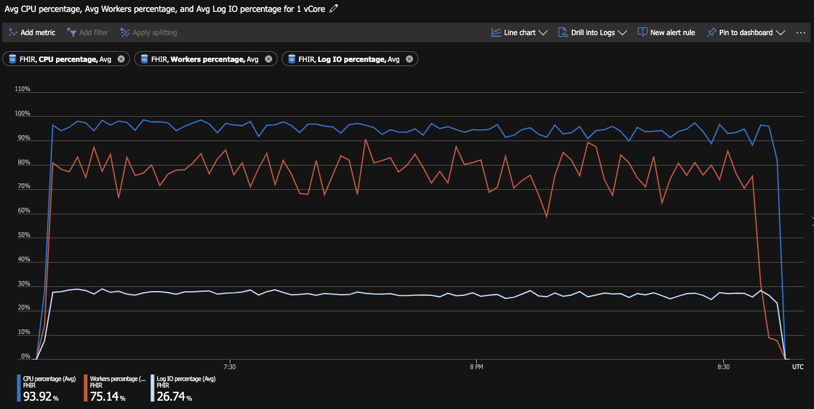
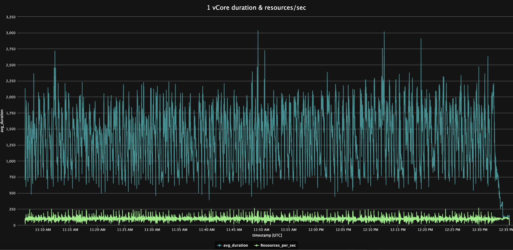

#### 2vCore_Standard_Optimized
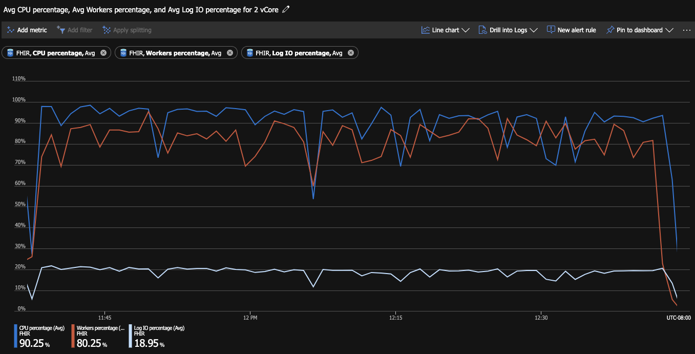
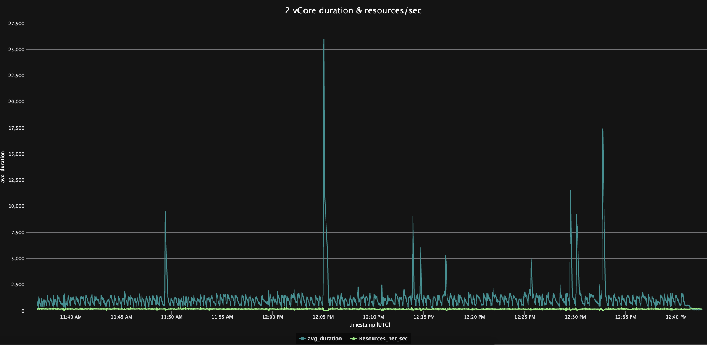

#### 4vCore_Standard_Optimized
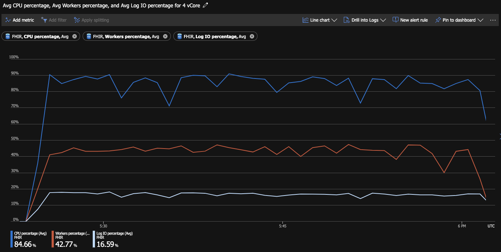
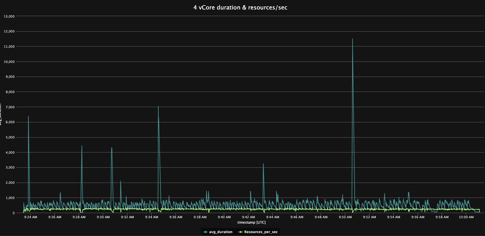

#### 8vCore_Standard_Optimized
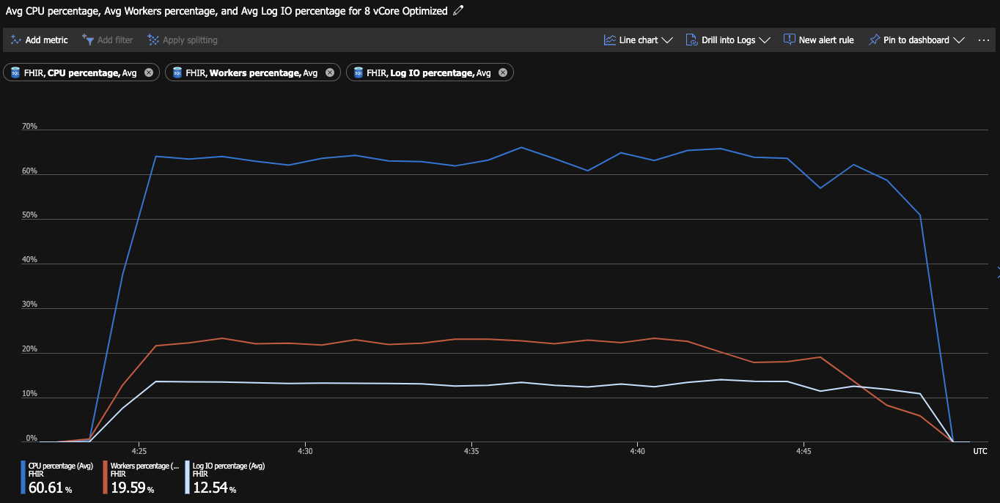


#### 16vCore_Standard_Optimized
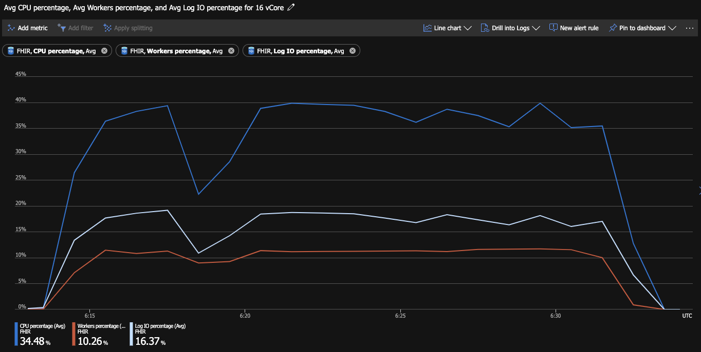
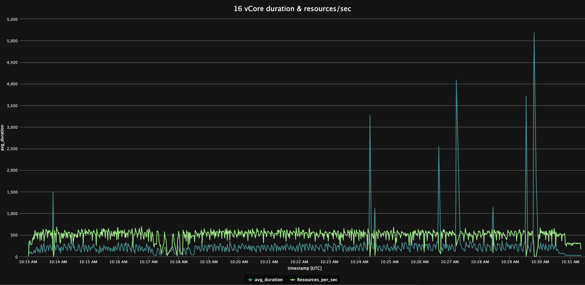

#### 80vCore_Standard_Optimized
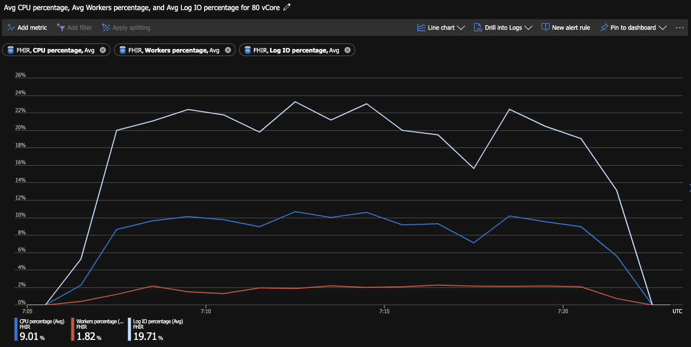
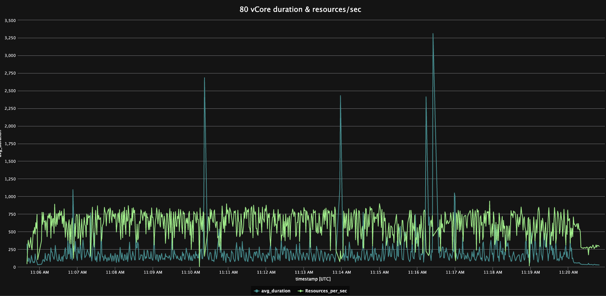

#### 1600DTU_Optimized
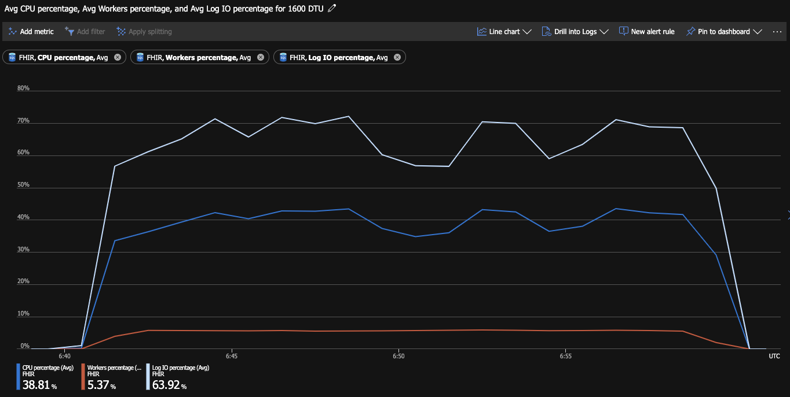
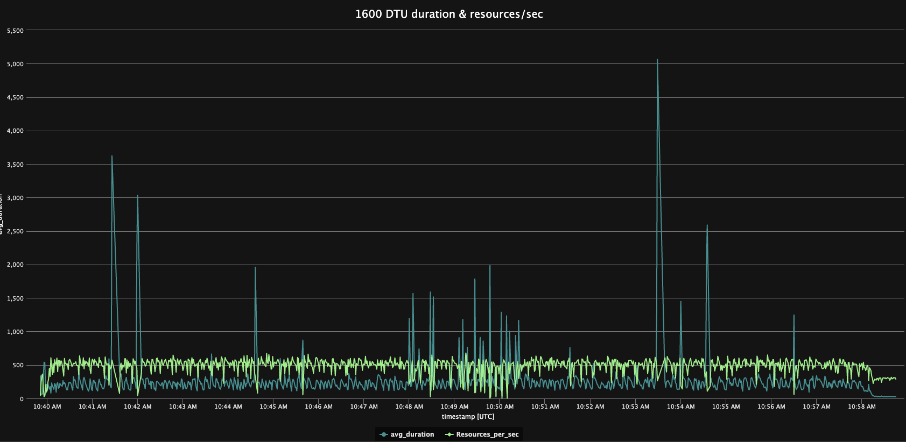

## Other findings
### Scaling limitations
In an attempt to get more throughput out of the higher server SKUs, a number of different approaches were taken, with one enabling better throughput. The usual symptom seen on the failed attempts was that the number of concurrent calls would increase which would cause contention to rise and ultimately lead to some sort of timeout.

#### Successful scaling approach
It was possible to get an 80 vCore server run to complete in just under 11 minutes through a number of tweaks. 

Changes
* Scale the front end to 4 instances
* Increase the max pool size to 300
* Increase the thread count in the function to 20
* Increase the queue batch size to 16

| Name                   | No. of Operations | min_timestamp              | max_timestamp              | duration | avg    | 50 percentile | 90 percentile | 95 percentile | 99 percentile | 99.9 percentile |
|------------------------|-------------------|----------------------------|----------------------------|----------|--------|---------------|---------------|---------------|---------------|-----------------|
| 80vCore_BestTrhoughput | 527,113           | 2/19/2020, 10:54:56.722 PM | 2/19/2020, 11:05:40.786 PM | 0:10:44  | 305.14 | 263.12        | 553.66        | 713.32        | 1138.07       | 2330.59         |

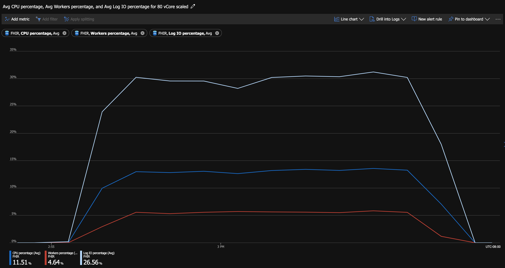
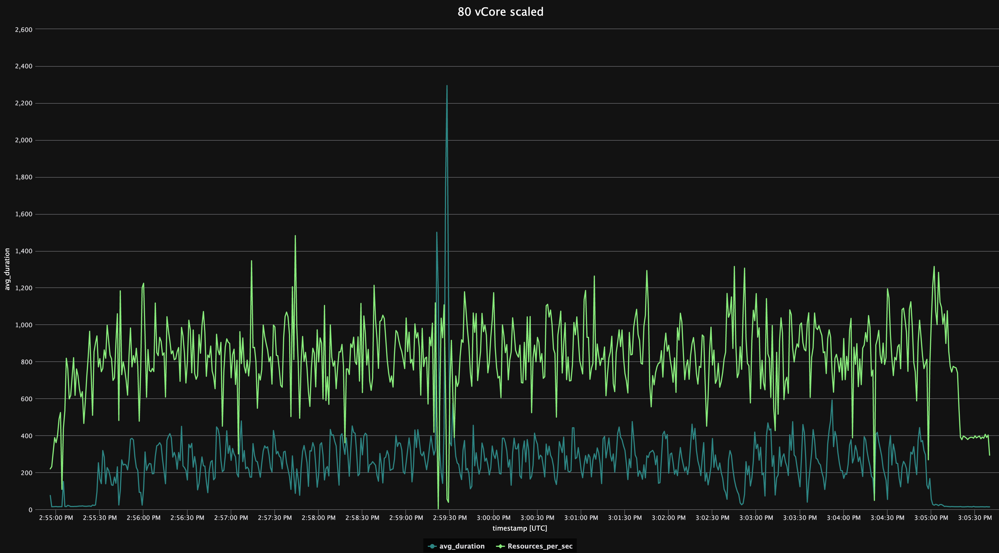

#### Using Azure Functions
Another thing attempted was to run the importer function directly in the Azure Function service. This was achievable and would generally work. By default there is no limit to the number of servers that will spin up and attempt to process the blobs, so this inundated the server with requests. 

There is a beta feature to limit the execution to up to 5 servers, but this seemed to exhibit similar behavior. 

Another oddity of using the Azure Function service is that it would not fully drain the storage container of the requested resources. When the number of blobs left was under 50, it would take long pauses between pulling a new item from the container.

#### Connection pool limits
By default the connection to Sql Server has a limit of the pool size at 100. When attempting many concurrent calls during the scaling attempts, there were a number of times that timeouts were experienced while attempting to get a connection. This was alleviated by increasing the `max pool size` on the connection string.

#### Identity Server
The default Identity Server configuration also cannot handle a large load of concurrent calls. While attempting high scale scenarios (like those from the Azure Function Service) security was disabled.

### Hyperscale
A number of runs were performed with Hyperscale. The results for 8 vCore and 16 vCore instances are below. The overall performance was almost in line with the standard non-hyperscale SKU. One thing to note is that when scaled to 80 vCores the throughput dropped significantly. Before Hyperscale was made available this would need to be investigated

| Name                         | No. of Operations | min_timestamp              | max_timestamp              | duration | avg    | 50 percentile | 90 percentile | 95 percentile | 99 percentile | 99.9 percentile |
|------------------------------|-------------------|----------------------------|----------------------------|----------|--------|---------------|---------------|---------------|---------------|-----------------|
| 8vCore_Hypserscale_Optimized | 526,934           | 2/18/2020, 9:42:47.139 PM  | 2/18/2020, 10:06:59.426 PM | 0:24:12  | 334.14 | 264.24        | 618.25        | 792.34        | 1275.18       | 4823.44         |
| 16vCore_Hyperscale_Optimized | 526,613           | 2/18/2020, 10:53:15.555 PM | 2/18/2020, 11:11:32.268 PM | 0:18:17  | 239.51 | 187.60        | 409.96        | 523.57        | 941.08        | 5847.17         |

#### 8vCore_hyperscale
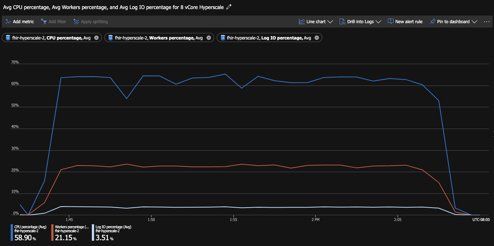
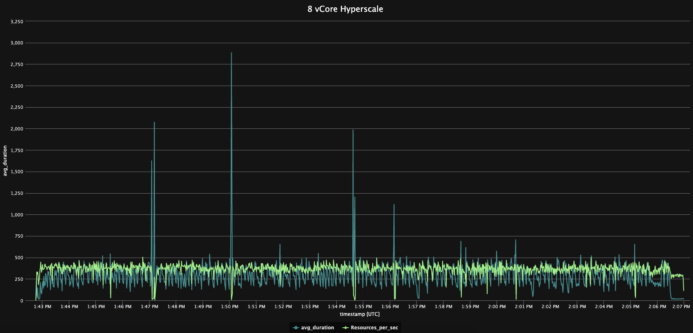

#### 16vCore_hyperscale
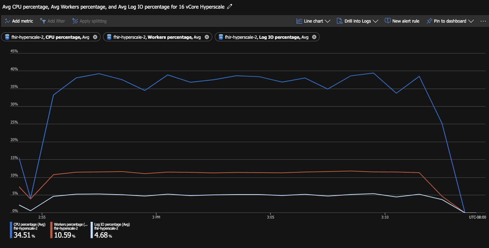
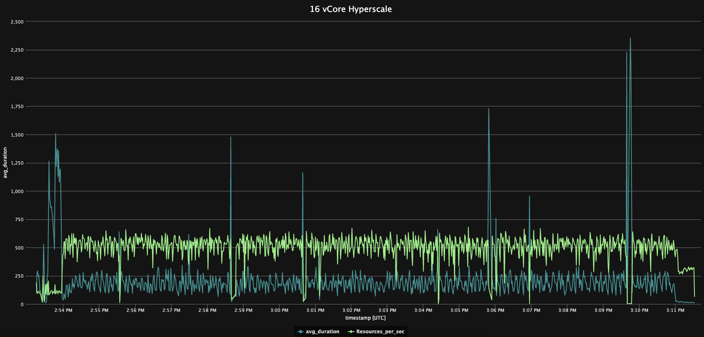

### Azure Monitor Workspace 
There exists a Azure Monitor workspace for [Azure SQL Analytics](https://docs.microsoft.com/en-us/azure/azure-monitor/insights/azure-sql). This workspace offers some great visualization into things such as exceptions and wait times. This is something that would probably be incredibly handy for managing a large number of SQL instances.