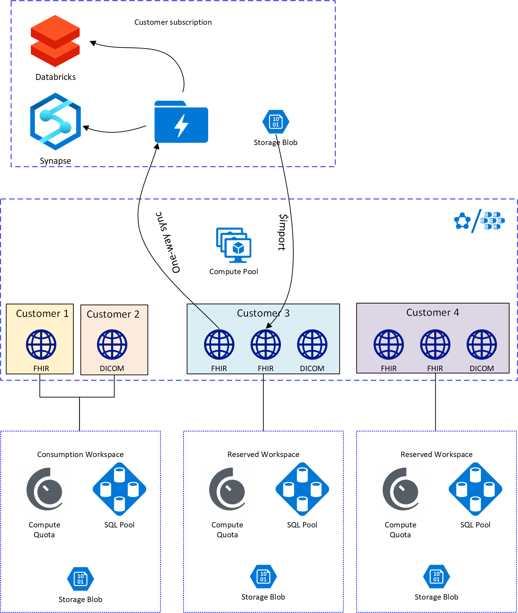

After the launch of the Azure API for FHIR, customers have identified some performance and cost challenges with the service. At the same time we are also looking to integrate new services (DICOM, de-dentification, analytics, etc.) into our service portfolio. There is a need for a common platform that will allow us to integrate new functionality while leveraging existing compute and indexing infrastructure. This spec outlines a new service model along with key technical components. The details around these sub-components may be captured in other specs; the goal of this document is to capture the high-level architecture. The new service model will enable/include the following features:

1. Adoption of SQL persistence provider for structured indexes. Both FHIR and DICOM use SQL for search indexes.
2. Separation of "services" and "workspaces". A workspace is the consumption unit that the customer will be billed for. The workspace comprises both structured and unstructured storage along with compute resources (quota). In a given workspace, the customer can instantiate multiple services, e.g. FHIR services, DICOM services, etc.
3. Separation of transactional service access and background jobs. Functions such as import, export, re-indexing, and de-identification can be long running operations that consume considerable amount of compute resources. The new architecture will introduce a pool of workers that can scale independently of the service compute resources.
4. High-performance ingest for FHIR service. Leveraging the worker pool, we will implement a fast `$import` operation for the FHIR service.
5. Continuous export/sync to analytics data store. Customers want to analyze their healthcare data with other tools such as Synapse or Databricks and they may want to add alternative indexing (elastic search), the new architecture will provide access to a view of the data in raw form for secondary analysis and use.
6. Ability to "seed" a service (FHIR or DICOM) from an existing service (in combination with de-identifications).

The high-level architecture will look like this:



[[_TOC_]]

# Business Justification

Customers are challenging us to deliver more capabilities while reducing cost. We are approximately 5-10 times more expensive than GCP, yet we lack some basic functionality that GCP provides. We are at risk of not being able to accommodate large customer workloads, and we could lose existing customers that have become aware of the cost of our service at scale.

We need to deliver:

1. Improved ingest performance to allow customers to bring large workloads.
1. Transaction support for FHIR.
1. Improved search capabilities for FHIR (e.g. joins, custom search parameters).
1. An ability to perform analytics (Synapse, Databricks, etc.) on healthcare data.

It is assumed that we can deliver those capabilities while reducing our costs. That will only be possible if we a) ship SQL to the managed service and b) move to a multi-tenant architecture where provisioned resources can be shared across services. At the same time, we should take the opportunity add some shared compute to our environments that can be utilized for import/export and also for projecting/syncing all/selected data to analytics data store.

# Scenarios

The proposed changes will:

1. Enable customers to host multiple services (multiple FHIR, multiple DICOM, etc.) on a single consumption unit (workspace) and share the resources across services.
1. Enable customers to start with a cheaper SKU in a shared consumption workspace.
1. Allow efficient ingest of large amounts of data (to hydrate a service).
1. Improve performance of background jobs (import/export, re-indexing).
1. Bring advanced search capabilities and transactions to the managed service.
1. Enable secondary (analytics) use of the data in the services.
1. Improve provisioning speed for new services in existing workspaces.

# Design

This high-level design includes multiple components, some of which may be subject of separate detailed specs. The components are related and described here with enough detail to understand key features and connections between them. The design introduces several new concepts and a list of definitions is included.

## Definitions

* **Workspace**: The consumption unit that a customer will be billed for. The workspace will include both compute and storage resources. A workspace can contain multiple **services**. There are two kinds of workspaces:
  * *Consumption Workspace*: A customer pays no hourly costs and is charged only for storage and number of service calls.
  * *Reserved Workspace*: A customer pays hourly rates for reserved compute and database throughput capacity and there are no charges per service call.
* **Service**: A Healthcare APIs service such as FHIR or DICOM Web.

## Services

A **service** defines a specific healthcare related API such as FHIR or DICOM. In the managed service environment, it is represented as a `Microsoft.HealthcareApis/workspaces/fhirServices` or `Microsoft.HealthcareApis/workspaces/dicomServices` resource and the `kind` indicates the specific flavor of that type of service (`fhir-r4`).

```jsonc
{
    "type": "Microsoft.HealthcareApis/workspaces/fhirServices",
    "apiVersion": "2020-12-25", // A Christmas present
    "name": "myfhirservice",
    "location": "westus2",
    "kind": "fhir-R4",
    "properties": {
        // ... all the other properties pertaining to this service
    }
}
```

Here are some properties that would belong to the service:

1. RBAC settings (AAD tenant, etc.).
2. Managed identity (e.g. for FHIR `$export` to BLOB) and syncing to data lake storage).
3. CORS settings.
4. Sync settings for analytics store.

For services running in a consumption workspace the end goal would be to have multiple services running in the same process in order to minimize fixed costs. We might have a pool of workers process requests from an arbitrary number of services. Since, this would require some rearchitecting of the FHIR service we will, in the interim, maintain a single service per process but reduce the memory consumption and the number of service instances to one (except during upgrades). Services could (optionally) be unloaded (scale to zero) when inactive to conserve resources.

## Workspaces

The workspace is the representation of the *compute*  and *storage* resources that the customer will be billed for. The ARM representation could look like this:

```jsonc
{
    "type": "Microsoft.HealthcareApis/workspaces",
    "apiVersion": "2020-12-25",
    "name": "mysharedworkspace",
    "location": "westus2",
    "kind": "Consumption", // Or Reserved.
    "properties": {
        // All the properties pertaining to this workspace
    }
}
```

A reserved capacity workspace would look something like:

```jsonc
{
    "type": "Microsoft.HealthcareApis/workspaces",
    "apiVersion": "2020-12-25",
    "name": "myreservedworkspace",
    "location": "westus2",
    "kind": "Reserved",
    "properties": {
        "compute": {
            // Alternatively we could just use P1, P2, etc.
            "vCores": 2
        },
        "persistence": {
            "vCores": 2
        },

        // All other properties pertaining to this workspace
    }
}
```

For reserved workspaces, we have to provide customer with metrics that let them know if they are oversubscribing the resources they have allocated. If we choose pre-packaged compute and memory configurations, it may also be necessary to offer high memory (e.g. P1m, P2m, etc.) SKUs if customers are predominately leveraging products that consume a lot of memory; memory consumption may be different between DICOM and FHIR and a FHIR service performing validation may consume more memory than one that doesn't. The customer must be able to update the number of allocated vCores without interrupting the service.

It will be critical to not to regress CPU and memory consumption during our normal engineering cadence, especially for reserved workspaces. We will therefor need to introduce regular performance and load testing for common scenarios.

The workspace is a logical organization of services but it is also a billing unit and resource governance construct, which will impose limits on the running services in terms of the resources they can consume.

An alternate ARM model would have the FHIR and DICOM as top-level resources that link to the workspace resource. For child resources, we will need to decide on whether [Tracked or Proxy](https://armwiki.azurewebsites.net/rp_onboarding/tracked_vs_proxy_resources.html) resources are the right model.

There are two flavors of these resource constraints depending type of workspace you have:

* **Consumption**: In the consumption mode, a service will be sharing compute resources with other customers' services. To avoid noisy neighbors, the services on shared services plans will be throttled based on the number of requests per minute. This limit will be relatively low, e.g. less than 10k requests per minute and the customer will be charged based on the number of calls (see below). To help customers understand their throttling limits, we can return headers indicating how much of their quota they have consumed and we can provide metrics.
  
  Inactive services (say 5 minutes of inactivity) can optionally be scaled to zero instances. In Kubernetes, this could be achieved with a scale-to-zero solution such as [Osiris](https://github.com/deislabs/osiris). A test with Osiris shows that it takes approximate 15s to bring the service back up.

* **Reserved**: A reserved capacity workspace is dedicated to a customer. It is allocated in terms of a number of vCores and GB of memory. This could optionally be expressed in terms of a number of predefined SKU sizes (e.g. P1, P2, P3, etc). Services running on a reserved workspace can have more than one service instance running and unloading of inactive services can would be disabled (always on).

    A practical realization of this could be to have node pools with VMs corresponding to the service plan sizes and then assign all of services belonging to a specific workspace to a node or set of nodes. In Kubernetes this is done with the pod `nodeSelector`). In Service Fabric, this would be done with node types. Neither [Service Fabric](https://docs.microsoft.com/en-us/azure/service-fabric/service-fabric-resource-governance) or Kubernetes appears to provide a way to limit a group of services to remain within certain resource constraints.

    **Note:** The reseource governance is still being investigated.

    The reserved workspace will also have dedicated structured (SQL) and unstructured (blob) storage capacity, initially for DICOM. The structured storage will be based on Elastic Pool (possibly HyperScale when it ships) SQL server and the unstructured storage will be a Storage Account. Each service that uses the workspace will have a dedicated database in the elastc pool. Each service will also have its own container (or set of containers) in the storage account to separate the data from different services. We may need to use ADLS to be able to create access controls at the container level.

Customers should have a migration path from Consumption to Reserved workspace, which would involve a database migration from one elastic pool to another, but it may not be possible to offer a migration path back to a Consumption workspace since Reserved workspaces will offer othe features such as BYOK, private link, etc.

### Workspace Billing

All workspaces emit the following billing meters:

1. Compute capacity *hourly charge*. This is equivalent to the $.40/hour currently charged for the PaaS FHIR service.
   1. For consumption workspaces, this will be zero ($0/hour).
   1. For reserved workspaces, this will be proportional to the allocated resources.
2. *Per request* charge.
   1. For consumption workspaces, the first e.g. 10k requests per month are free and then some charge (TBD) per 1000 requests after that.
   2. For reserved workspaces this charge is zero (unlimited requests within the resource consumption limits)
3. Unstructured storage. A per GB/month charge for storage in blob or ALDS.
4. Structured storage. A per GB/month charge for data stored in SQL
   1. For consumption workspaces, this will be a higher charge, e.g. $.50/Gb/month (or $.39/Gb/month to be competitive with GCP).
   2. For reserved workspaces, the charge will be lower, e.g. $.25/Gb/month.
5. Provisioned storage compute (optional). Only relevant if we choose to let customers specifically adjust the storage compute. It is an hourly charge based on the number of cores allocated to the structured storage.
   1. For consumption workspaces, this is zero (we will shared the compute among customers and charge based on the amount of data).
   2. For reserved workspaces, this will be proportional to the number of dedicated cored in the HS SQL instance.

## Operational Cost Reduction

One current problem of our FHIR service is the high cost of running the service. Specifically, it takes a considerable amount of CPU and memory to operate the service. There are a number of workstreams that could be initiated to improve the current resource consumption profile. The work on these improvements can happen before, during, or after the change of the service model as outlined in this spec. The areas of improvement are:

1. Memory footprint. The current service memory footprint is on the order of 0.5Gib per running service instance. Much of that is owed to data structures in the .NET FHIR API. We could onload that on inactivity and load it lazily.
2. Number of running instances. Our current PaaS service infrastructure requires that we run at least two service instances, but this is not tecnically necessary except during service upgrades. As discussed above, we could change the model to use only a single instance and just surge when we need to upgrade. This means we would have to do upgrade sin batches. We would have to investigate and validate that a single instance approach does not compromise our pre-defined SLA.
3. Reduce CPU consumption. The CPU consumption for the service is very high. It really cannot scale at the moment. The main reasons are serialization/deserialization and FHIR Path evaluations. Some of these problems may be mitigated with some minor changes. For example, resources could be served straight out of the database instead of deserializing, patching with `_lastUpdated`, etc., serializing and then returning to the client.
4. Multi-tenancy in the process. Instead of running an independent process for each FHIR service, we could serve multiple accounts out of a single FHIR service instance.

## Background workers and jobs

Services will support bulk operations that are performed asynchronously by a separate compute pool. This pool will be elastic, scaling out and in as needed. It will be used for operations such as bulk import, bulk export, and reindexing. Along with the background workers will be job queue, where all services in a region can submit jobs for the background workers. The length of the queue can be used to scale the worker pool. The design of this general purpose worker pool and job queue will be the subject of a separate spec.

As an example use case, it will be used to for bulk import of data.

### Bulk import

Our bigger customers have a need to efficiently ingest a large number resources into an existing service or to seed a new service. There are both use cases for one-off hydration of new services and bulk ingestion at regular intervals (nightly ingest of large amounts of data). Performing these inserts over the RESTful API, by upserting individual resources or bundles, cannot currently be done fast enough with the SQL persistence provider to be able to meet our performance target, which is to be able to ingest 1 million patient records in under a day . 1 million Synthea patients per day is around 350 million resources, which translates to a minimum target throughput of around **4,000 resources per second**.

Currently, with Azure SQL, we can get to around 1500 resources per seconds when upserting individual resources. (Cosmos DB's throughput scales linearly with provisioned RUs, and does not have this low limit). The bottleck is page latch contention as many concurrent workers writing to the same data pages, a by-product of using sequential indexes (the leading column of all clustered indexes is `ResourceSurrogateId`, a monotonically-increasing encoding of the insertion time). 

We have several options for increasing the throughput:

1. Introduce an alternate mechanism for bulk insert that does not use the same stored procedure, but instead bulk copies data directly to the database tables.
2. Use the `OPTIMIZE_FOR_SEQUENTIAL_KEY` option for indexes, which is designed to reduced page latch contention. This option was not generally available when the SQL persistence provider was initially developed in 2019.
3. Generalize the stored procedure used to upsert a resource to be able to handle a set of resources. A proof of concept of this showed a nearly 5x performance gain. 
4. Allow the administrator to configure which search parameters they want to enable, thus potentially reducing the size of the index tables. This will be desirable regardless of the import mechanism and will additionally reduce costs as and improve search performance. 

A prototype of (1) has shown a theoretical throughput of nearly 11K resources per second. We however took a couple of shortcuts, such as assuming that there were no resource ID collisions either within the import set or with the the existing resources in the database. This approach also requires taking the database offline as non-clustered indexes are disabled. During the import we could keep the FHIR service online in read-only mode, pointing a snapshot the database before the bulk import process.

In scenarios where the FHIR server must remain online and writeable during the import process, we will need to employ option (3), possibly in conjunction with option (2).

Another problem we currently have is the enormous CPU consumption of the ingest process. The time is spent deserializing and running FHIRPath queries over resources. To work around this, we will need to partition the bulk ingest processing into a number of workers, each of them reserving a resource surrogate ID range and bulk inserting to the database tables concurrently. 

Longer-term, we will need to dramatically overhaul or replace the Firely FHIR libraries that we use in order to reduce the costs of the bulk import. This will also benefit scenarios using the RESTful FHIR API.

## Secondary Data Usage (Analytics)

Customers want analyze FHIR data with more powerful tools than FHIR search. We could achieve this by "exposing" the raw resources in some form. Rather than exposing them directly from the source of truth (SQL or BLOB storage), we should add an eventually consistent, one-way sync to an analytics store such as Azure Data Lake Storage (ADLS). (TODO: Pricing)

One way to realize this would be by introducing a change feed in the SQL data store (along the lines of what is being explored for DICOM). Based on this changefeed, idle workers in the workerpool could be assigned to exporting data to an analytics store. It would effectively be a continuous export.

# Dependencies and ordering of work

The implementation of the new service model has some dependent work items that will need to be done in the right order, but other items such as reducing the cost of the service and worker pools can be worked on independently.

The dependency graph below illustrates this as a high level:

## Legend

[](https://mermaid-js.github.io/mermaid-live-editor/#/edit/eyJjb2RlIjoiZ3JhcGggVERcbiAgICBjbGFzc0RlZiBvc3MgZmlsbDogcmVkLCBzdHJva2U6IHJlZCwgY29sb3I6IHdoaXRlXG4gICAgY2xhc3NEZWYgcGFhcyBmaWxsOiBibHVlLCBzdHJva2U6IGJsdWUsIGNvbG9yOiB3aGl0ZVxuICAgIGNsYXNzRGVmIG9zcy1wYWFzIGZpbGw6IHB1cnBsZSwgc3Ryb2tlOiBwdXJwbGUsIGNvbG9yOiB3aGl0ZVxuXG4gICAgT1NTOjo6b3NzXG4gICAgUGFhUzo6OnBhYXNcbiAgICBwYWFzLW9zc1tQYWFTIGFuZCBPU1NdOjo6b3NzLXBhYXNcbiIsIm1lcm1haWQiOnsidGhlbWUiOiJkZWZhdWx0In0sInVwZGF0ZUVkaXRvciI6ZmFsc2V9)

## Adopt SQL

[](https://mermaid-js.github.io/mermaid-live-editor/#/edit/eyJjb2RlIjoiZ3JhcGggVERcbiAgICBjbGFzc0RlZiBvc3MgZmlsbDogcmVkLCBzdHJva2U6IHJlZCwgY29sb3I6IHdoaXRlXG4gICAgY2xhc3NEZWYgcGFhcyBmaWxsOiBibHVlLCBzdHJva2U6IGJsdWUsIGNvbG9yOiB3aGl0ZVxuICAgIGNsYXNzRGVmIG9zcy1wYWFzIGZpbGw6IHB1cnBsZSwgc3Ryb2tlOiBwdXJwbGUsIGNvbG9yOiB3aGl0ZVxuXG5cbiAgICBzcWxbU1FMIERhdGEgU3RvcmVdOjo6cGFhc1xuICAgIHNxbERhdGFiYXNlQ3JlZGVudGlhbHNbU1FMIGNyZWRlbnRpYWwgaGFuZGxpbmddOjo6cGFhc1xuICAgIHNxbFNjaGVtYUxpZmVjeWNsZVtTUUwgU2NoZW1hIExpZmVjeWNsZV06OjpwYWFzXG4gICAgc3FsUGVyZm9ybWFuY2VUZXN0aW5nW1NRTCBQZXJmb3JtYW5jZSBUZXN0aW5nXTo6Om9zc1xuICAgIGVsYXN0aWNQb29sTWFuYWdlbWVudFtFbGFzdGljIFBvb2wgTWFuYWdlbWVudF06OjpwYWFzXG5cbiAgICBzcWwgLS0-IHNxbFNjaGVtYUxpZmVjeWNsZSAmIHNxbFBlcmZvcm1hbmNlVGVzdGluZyAmIGVsYXN0aWNQb29sTWFuYWdlbWVudCAmIHNxbERhdGFiYXNlQ3JlZGVudGlhbHMiLCJtZXJtYWlkIjp7InRoZW1lIjoiZGVmYXVsdCJ9LCJ1cGRhdGVFZGl0b3IiOmZhbHNlfQ)

## Consumption SKU

[![](https://mermaid.ink/svg/eyJjb2RlIjoiZ3JhcGggVERcbiAgICBjbGFzc0RlZiBvc3MgZmlsbDogcmVkLCBzdHJva2U6IHJlZCwgY29sb3I6IHdoaXRlXG4gICAgY2xhc3NEZWYgcGFhcyBmaWxsOiBibHVlLCBzdHJva2U6IGJsdWUsIGNvbG9yOiB3aGl0ZVxuICAgIGNsYXNzRGVmIG9zcy1wYWFzIGZpbGw6IHB1cnBsZSwgc3Ryb2tlOiBwdXJwbGUsIGNvbG9yOiB3aGl0ZVxuXG4gICAgd29ya3NwYWNlQmlsbGluZ1tXb3Jrc3BhY2UgQmlsbGluZyBNb2RlbF06OjpwYWFzXG5cbiAgICBzcWxbU1FMIERhdGEgU3RvcmVdOjo6cGFhc1xuXG5cbiAgICBjb25zdW1wdGlvblJlc291cmNlR292ZXJuYW5jZVtDb25zdW1wdGlvbiBSZXNvdXJjZSBHb3Zlcm5hbmNlXTo6OnBhYXNcblxuICAgIGNvbnN1bXB0aW9uTWV0cmljc1tDb25zdW1wdGlvbiBNZXRyaWNzXTo6OnBhYXNcblxuICAgIGNvbnN1bXB0aW9uU2t1W0NvbnN1bXB0aW9uIFNLVV06OjpwYWFzXG5cbiAgICBjb25zdW1wdGlvblNrdSAtLT4gd29ya3NwYWNlQmlsbGluZyAmIGNvbnN1bXB0aW9uTWV0cmljcyAmIHNxbCAmIGFybU1vZGVsICYgdm1Ta3VTZWxlY3Rpb24gJiBjb25zdW1wdGlvblJlc291cmNlR292ZXJuYW5jZVxuXG4gICAgdm1Ta3VTZWxlY3Rpb25bVk0gU0tVIFNlbGVjdGlvbl06OjpwYWFzXG5cbiAgICBcblxuICAgIGFybU1vZGVsW0FSTSBNb2RlbF06OjpwYWFzXG4gICAgcG9ydGFsW1BvcnRhbF06OjpwYWFzXG4gICAgc2Rrc1tcIlNES3MgKENMSSwgUFMsIGV0Yy4pXCJdOjo6cGFhc1xuXG4gICAgc2RrcyAtLT4gYXJtTW9kZWxcbiAgICBwb3J0YWwgLS0-IGFybU1vZGVsXG4iLCJtZXJtYWlkIjp7InRoZW1lIjoiZGVmYXVsdCJ9LCJ1cGRhdGVFZGl0b3IiOmZhbHNlfQ)](https://mermaid-js.github.io/mermaid-live-editor/#/edit/eyJjb2RlIjoiZ3JhcGggVERcbiAgICBjbGFzc0RlZiBvc3MgZmlsbDogcmVkLCBzdHJva2U6IHJlZCwgY29sb3I6IHdoaXRlXG4gICAgY2xhc3NEZWYgcGFhcyBmaWxsOiBibHVlLCBzdHJva2U6IGJsdWUsIGNvbG9yOiB3aGl0ZVxuICAgIGNsYXNzRGVmIG9zcy1wYWFzIGZpbGw6IHB1cnBsZSwgc3Ryb2tlOiBwdXJwbGUsIGNvbG9yOiB3aGl0ZVxuXG4gICAgd29ya3NwYWNlQmlsbGluZ1tXb3Jrc3BhY2UgQmlsbGluZyBNb2RlbF06OjpwYWFzXG5cbiAgICBzcWxbU1FMIERhdGEgU3RvcmVdOjo6cGFhc1xuXG5cbiAgICBjb25zdW1wdGlvblJlc291cmNlR292ZXJuYW5jZVtDb25zdW1wdGlvbiBSZXNvdXJjZSBHb3Zlcm5hbmNlXTo6OnBhYXNcblxuICAgIGNvbnN1bXB0aW9uTWV0cmljc1tDb25zdW1wdGlvbiBNZXRyaWNzXTo6OnBhYXNcblxuICAgIGNvbnN1bXB0aW9uU2t1W0NvbnN1bXB0aW9uIFNLVV06OjpwYWFzXG5cbiAgICBjb25zdW1wdGlvblNrdSAtLT4gd29ya3NwYWNlQmlsbGluZyAmIGNvbnN1bXB0aW9uTWV0cmljcyAmIHNxbCAmIGFybU1vZGVsICYgdm1Ta3VTZWxlY3Rpb24gJiBjb25zdW1wdGlvblJlc291cmNlR292ZXJuYW5jZVxuXG4gICAgdm1Ta3VTZWxlY3Rpb25bVk0gU0tVIFNlbGVjdGlvbl06OjpwYWFzXG5cbiAgICBcblxuICAgIGFybU1vZGVsW0FSTSBNb2RlbF06OjpwYWFzXG4gICAgcG9ydGFsW1BvcnRhbF06OjpwYWFzXG4gICAgc2Rrc1tcIlNES3MgKENMSSwgUFMsIGV0Yy4pXCJdOjo6cGFhc1xuXG4gICAgc2RrcyAtLT4gYXJtTW9kZWxcbiAgICBwb3J0YWwgLS0-IGFybU1vZGVsXG4iLCJtZXJtYWlkIjp7InRoZW1lIjoiZGVmYXVsdCJ9LCJ1cGRhdGVFZGl0b3IiOmZhbHNlfQ)

## Premium SKU

[![](https://mermaid.ink/svg/eyJjb2RlIjoiZ3JhcGggVERcbiAgICBjbGFzc0RlZiBvc3MgZmlsbDogcmVkLCBzdHJva2U6IHJlZCwgY29sb3I6IHdoaXRlXG4gICAgY2xhc3NEZWYgcGFhcyBmaWxsOiBibHVlLCBzdHJva2U6IGJsdWUsIGNvbG9yOiB3aGl0ZVxuICAgIGNsYXNzRGVmIG9zcy1wYWFzIGZpbGw6IHB1cnBsZSwgc3Ryb2tlOiBwdXJwbGUsIGNvbG9yOiB3aGl0ZVxuXG4gICAgd29ya3NwYWNlQmlsbGluZ1tXb3Jrc3BhY2UgQmlsbGluZyBNb2RlbF06OjpwYWFzXG5cbiAgICBzcWxbU1FMIERhdGEgU3RvcmVdOjo6cGFhc1xuXG5cbiAgICBwcmVtaXVtUmVzb3VyY2VHb3Zlcm5hbmNlW1ByZW1pdW0gUmVzb3VyY2UgR292ZXJuYW5jZV06OjpwYWFzXG5cbiAgICBwcmVtaXVtTWV0cmljc1tQcmVtaXVtIE1ldHJpY3NdOjo6cGFhc1xuXG4gICAgcHJlbWl1bVNrdVtQcmVtaXVtIFNLVV06OjpwYWFzXG5cbiAgICBwcmVtaXVtU2t1IC0tPiB3b3Jrc3BhY2VCaWxsaW5nICYgcHJlbWl1bU1ldHJpY3MgJiBzcWwgJiBhcm1Nb2RlbCAmIHZtU2t1U2VsZWN0aW9uICYgcHJlbWl1bVJlc291cmNlR292ZXJuYW5jZVxuXG4gICAgdm1Ta3VTZWxlY3Rpb25bVk0gU0tVIFNlbGVjdGlvbl06OjpwYWFzXG5cbiAgICBcblxuICAgIGFybU1vZGVsW0FSTSBNb2RlbF06OjpwYWFzXG4gICAgcG9ydGFsW1BvcnRhbF06OjpwYWFzXG4gICAgc2Rrc1tcIlNES3MgKENMSSwgUFMsIGV0Yy4pXCJdOjo6cGFhc1xuXG4gICAgc2RrcyAtLT4gYXJtTW9kZWxcbiAgICBwb3J0YWwgLS0-IGFybU1vZGVsIiwibWVybWFpZCI6eyJ0aGVtZSI6ImRlZmF1bHQifSwidXBkYXRlRWRpdG9yIjpmYWxzZX0)](https://mermaid-js.github.io/mermaid-live-editor/#/edit/eyJjb2RlIjoiZ3JhcGggVERcbiAgICBjbGFzc0RlZiBvc3MgZmlsbDogcmVkLCBzdHJva2U6IHJlZCwgY29sb3I6IHdoaXRlXG4gICAgY2xhc3NEZWYgcGFhcyBmaWxsOiBibHVlLCBzdHJva2U6IGJsdWUsIGNvbG9yOiB3aGl0ZVxuICAgIGNsYXNzRGVmIG9zcy1wYWFzIGZpbGw6IHB1cnBsZSwgc3Ryb2tlOiBwdXJwbGUsIGNvbG9yOiB3aGl0ZVxuXG4gICAgd29ya3NwYWNlQmlsbGluZ1tXb3Jrc3BhY2UgQmlsbGluZyBNb2RlbF06OjpwYWFzXG5cbiAgICBzcWxbU1FMIERhdGEgU3RvcmVdOjo6cGFhc1xuXG5cbiAgICBwcmVtaXVtUmVzb3VyY2VHb3Zlcm5hbmNlW1ByZW1pdW0gUmVzb3VyY2UgR292ZXJuYW5jZV06OjpwYWFzXG5cbiAgICBwcmVtaXVtTWV0cmljc1tQcmVtaXVtIE1ldHJpY3NdOjo6cGFhc1xuXG4gICAgcHJlbWl1bVNrdVtQcmVtaXVtIFNLVV06OjpwYWFzXG5cbiAgICBwcmVtaXVtU2t1IC0tPiB3b3Jrc3BhY2VCaWxsaW5nICYgcHJlbWl1bU1ldHJpY3MgJiBzcWwgJiBhcm1Nb2RlbCAmIHZtU2t1U2VsZWN0aW9uICYgcHJlbWl1bVJlc291cmNlR292ZXJuYW5jZVxuXG4gICAgdm1Ta3VTZWxlY3Rpb25bVk0gU0tVIFNlbGVjdGlvbl06OjpwYWFzXG5cbiAgICBcblxuICAgIGFybU1vZGVsW0FSTSBNb2RlbF06OjpwYWFzXG4gICAgcG9ydGFsW1BvcnRhbF06OjpwYWFzXG4gICAgc2Rrc1tcIlNES3MgKENMSSwgUFMsIGV0Yy4pXCJdOjo6cGFhc1xuXG4gICAgc2RrcyAtLT4gYXJtTW9kZWxcbiAgICBwb3J0YWwgLS0-IGFybU1vZGVsIiwibWVybWFpZCI6eyJ0aGVtZSI6ImRlZmF1bHQifSwidXBkYXRlRWRpdG9yIjpmYWxzZX0)

## Cost Reduction

[](https://mermaid-js.github.io/mermaid-live-editor/#/edit/eyJjb2RlIjoiZ3JhcGggVERcbiAgICBjbGFzc0RlZiBvc3MgZmlsbDogcmVkLCBzdHJva2U6IHJlZCwgY29sb3I6IHdoaXRlXG4gICAgY2xhc3NEZWYgcGFhcyBmaWxsOiBibHVlLCBzdHJva2U6IGJsdWUsIGNvbG9yOiB3aGl0ZVxuICAgIGNsYXNzRGVmIG9zcy1wYWFzIGZpbGw6IHB1cnBsZSwgc3Ryb2tlOiBwdXJwbGUsIGNvbG9yOiB3aGl0ZVxuXG4gICAgcmVkdWNlZENvc3RbUmVkdWNlZCBDb3N0XTo6Om9zcy1wYWFzXG5cbiAgICBsb3dNZW1bUmVkdWNlIG1lbW9yeSBmb290cHJpbnRdOjo6b3NzXG4gICAgc2luZ2xlSW5zdGFuY2VbU2luZ2xlIGluc3RhbmNlIFBhYVNdOjo6cGFhc1xuICAgIG11bHRpVGVuYW5jeVByb2Nlc3NbTXVsdGkgdGVuYW5jeSBpbiBwcm9jZXNzXTo6Om9zc1xuICAgIHJlZHVjZUNwdVtSZWR1Y2UgQ1BVIGNvbnN1bXB0aW9uXTo6Om9zc1xuXG4gICAgcmVkdWNlZENvc3QgLS0-IGxvd01lbSAmIHNpbmdsZUluc3RhbmNlICYgcmVkdWNlQ3B1ICYgbXVsdGlUZW5hbmN5UHJvY2VzcyIsIm1lcm1haWQiOnsidGhlbWUiOiJkZWZhdWx0In0sInVwZGF0ZUVkaXRvciI6ZmFsc2V9)

## Fast Import

[](https://mermaid-js.github.io/mermaid-live-editor/#/edit/eyJjb2RlIjoiZ3JhcGggVERcbiAgICBjbGFzc0RlZiBvc3MgZmlsbDogcmVkLCBzdHJva2U6IHJlZCwgY29sb3I6IHdoaXRlXG4gICAgY2xhc3NEZWYgcGFhcyBmaWxsOiBibHVlLCBzdHJva2U6IGJsdWUsIGNvbG9yOiB3aGl0ZVxuICAgIGNsYXNzRGVmIG9zcy1wYWFzIGZpbGw6IHB1cnBsZSwgc3Ryb2tlOiBwdXJwbGUsIGNvbG9yOiB3aGl0ZVxuXG4gICAgZmFzdEltcG9ydFtGYXN0IEltcG9ydF06Ojpvc3MtcGFhc1xuICAgIGFwaUluZGVwZW5kZW50SW1wb3J0W0FQSS1JbmRlcGVuZGVudCBJbXBvcnRdOjo6b3NzXG4gICAgd29ya2VyUG9vbFtXb3JrZXIgUG9vbF06OjpwYWFzXG5cblxuICAgIGZhc3RJbXBvcnQgLS0-IGFwaUluZGVwZW5kZW50SW1wb3J0ICYgd29ya2VyUG9vbCIsIm1lcm1haWQiOnsidGhlbWUiOiJkZWZhdWx0In0sInVwZGF0ZUVkaXRvciI6ZmFsc2V9)


## Account Migration

[](https://mermaid-js.github.io/mermaid-live-editor/#/edit/eyJjb2RlIjoiZ3JhcGggVERcbiAgICBjbGFzc0RlZiBvc3MgZmlsbDogcmVkLCBzdHJva2U6IHJlZCwgY29sb3I6IHdoaXRlXG4gICAgY2xhc3NEZWYgcGFhcyBmaWxsOiBibHVlLCBzdHJva2U6IGJsdWUsIGNvbG9yOiB3aGl0ZVxuICAgIGNsYXNzRGVmIG9zcy1wYWFzIGZpbGw6IHB1cnBsZSwgc3Ryb2tlOiBwdXJwbGUsIGNvbG9yOiB3aGl0ZVxuXG4gICAgZGJSZXBsYXlbUmVwbGF5IENvc21vc106Ojpvc3NcbiAgICBkYk1pZ3JhdGlvbltDb3Ntb3MgdG8gU1FMIERhdGFiYXNlIE1pZ3JhdGlvbl06Ojpvc3NcbiAgICBtaWdyYXRlQWNjb3VudHNbTWlncmF0ZSBBY2NvdW50IEZlYXR1cmVdOjo6cGFhc1xuXG5cbiAgICBtaWdyYXRlQWNjb3VudHMgLS0-IGRiTWlncmF0aW9uXG4gICAgZGJNaWdyYXRpb24gLS0-IGRiUmVwbGF5IiwibWVybWFpZCI6eyJ0aGVtZSI6ImRlZmF1bHQifSwidXBkYXRlRWRpdG9yIjpmYWxzZX0)


Here are the workitems (somewhat order of priority) that we can start work on immediately:

1. Using elastic pool SQL to separate services.
2. Billing model (business modelling, not dev work).
3. Cosmos DB to SQL migration.
4. Worker pool and job queue.
5. Reduce memory footprint.
6. Reduce memory consumption.
7. Running a single instance of the service.
8. Multi-tenancy in process (we should defer this).

# Test Strategy

*Describe the test strategy.*

# Security

*Describe any special security implications or security testing needed.*

# Other

*Describe any impact to privacy, localization, globalization, deployment, back-compat, SOPs, ISMS, etc.*

# To Do List

Stuff to think about:

1. Regional replication?
1. Domain name at the workspace or service level?
1. Implications for Private Link?
1. BYOK. For dedicated workspaces only. Should it be at the service or workspace level?
1. Migration between shared and premium SKU. Is it one-way?
1. RBAC with B2C?
1. How do virtual views (slices in RBAC) fit in to this model? Should be introduce `Microsoft.HealthareApis/serviceView`?
