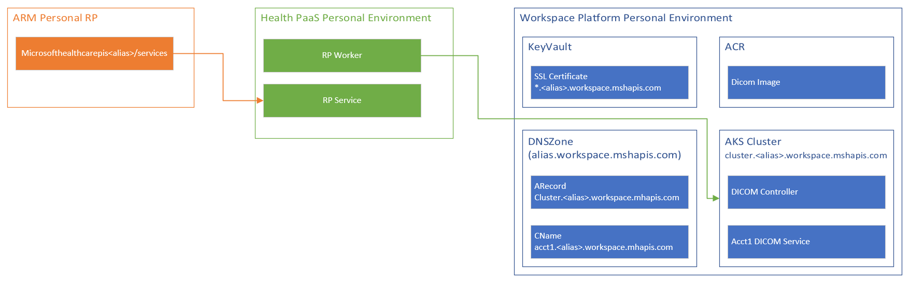

[Ev2 (Express v2)](https://aka.ms/ev2) is a specialized deployment service that provides single-click, health-integrated, secure and automated solution for deploying Azure resources in public and sovereign clouds. Ev2 orchestrates resource deployment across multiple regions and scale-units incorporating standard Azure-defined safety and compliance practices. 

[[_TOC_]]

## Business Justification

The gen2 service should make use of Ev2 to provide a declarative deployment mechanism that is line with standard Azure practices. Additionally, Ev2 provides an [extensibility framework](https://ev2docs.azure.net/features/extensibility/intro.html) to support many standard steps that traditionally required manual or scripted intervention.

## Scenarios

* [Environment rollout](#environment-rollout)
* [Service rollout](#service-rollouts)
* [Mapping RP -> AKS cluster](#mapping-rp-to-aks)
* [Synching of container registries (external docs)](https://docs.microsoft.com/en-us/azure/container-registry/container-registry-transfer-images)
* [Provisioning/setup of Geneva accounts (external docs)](https://ev2docs.azure.net/features/extensibility/http/common/Microsoft.Geneva.Logs.html)
* [Certificate management (external docs)](https://ev2docs.azure.net/features/extensibility/http/common/Microsoft.KeyVault.DataPlane.html#create-certificate)

## Metrics

TBD - Likely metrics will be added to support health checking on different rollout stages.

* Should be able to do a `kubectl wait` via a shell extension to wait for service image upgrades.

## Design

Mechanically speaking, the layout/structure of the files involved are decided by the [artifact layout](https://ev2docs.azure.net/getting-started/authoring/authoringoverview.html) dictated by Ev2.

### Environment rollout


Each rollout could be kicked off by a commit to the workspace platform repository or a manual release pipeline. The steps will generally be:

1. Build containers and push to a source ACR
1. Generate Ev2 artifacts needed for a rollout
1. Execute the rollout
1. Do global related items in Ev2 (ARM Resources, ACR Sync, Certificate Requirements)
1. Do regional related items in an SDP manner

#### Items included in environment rollout

* [AzSecPack/Geneva related requirements](../PaaS/Workspaces/Installation-Of-AzSecPack.md)
* Environment ACR
  * Storage account needed for sync
* ACR sync execution
* Environment KeyVault
* SSL certificate for environment
* Regional K8s clusters
* Regional ACR replication
* Roles related to AKS -> ACR

The idea is that each of the operations within the rollout would be idempotent such that when executed they would result in a no-op if they already exist in that state. This is supported natively by ARM and Kubernetes, but any scripting or custom extensions would need to follow this pattern.

#### Mapping RP to AKS

To support the mapping between the RP worker and the AKS infrastructure we will create an AKS mapping file in the `environments` folder with the naming convention of `<environment>.aks.json`. The initial content of this file will be something like the following.

```json
{
  "regions": [
    {
      "location": "westus2",
      "clusters": [
        {
          "name": "k8s-cluster-westus2-1"
        }
      ]
    },
    {
      "location": "eastus",
      "clusters": [
        {
          "name": "k8s-cluster-eastus-1"
        }
      ]
    }
  ]
}
```

Initially, each region will likely only have 1 cluster, but we will support an array per region. When the environment is provisioned in `health-paas` this information will be persisted to the global db and be made available to the provisioning services. These files will be manually created initially, but would likely be auto-generated via the `worksspace-platform` in the future.

To support the connection between the RP worker and the AKS infrastructure, AKS will be enabled to support AAD as the authentication provider. To handle this, a `adminGroupObjectIDs` should be added to the cluster definition. The groups added would need to include the RP service identity group along with any DRI related groups.

#### ACR Security

To support ACR with the appropriate permissions we should create the 'source' ACR within the AME tenant/subscription. This will allow us to lock down the role of `ACRPush` to the service principal in Azure Devops. Alongside this source we should also create the appropriate ACR pipeline and storage account so that we can seed the storage account with the containers from that registry. 

### Service rollouts

There will be service specific builds/rollouts that can be restricted by paths. There is a need to  have ran the infrastructure rollout at least once before any service specific rollouts can be done.


#### Items included in a service rollout

* ACR sync execution
* Service specific operator/K8s workloads
* [Service specific auto image manager](K8s-AutoImageManager.md)
* Service image spec rollouts

### Personal environments

There is a desire to keep the concept of a personal environment. This can most likely be supported via Ev2 as a rollout. We will likely need to create a script to create the personal rollout so that there is no need for keeping all off the rollouts in sync. 

The proposal below to support personal rollouts would need to have a spike to see about feasibility, but should generally be able to be accomplished.


The premise of the personal environment is that we can generate DNS entries and SSL certificates that match the `*.<alias>.workspace.mshapis.com` pattern. Once those are established, it would be possible to setup an RP to point to these environments along with a deployed PaaS personal environment. 



## Further investigation

* OneCert onboarding to support SSL Creation and support for personal environments
  * The cert should be able to be setup with auto-renewal and whatever mechanism used to sync this to the kubernetes cluster(s) should be aware/be able to react to new versions.
  * [Secret store CSI driver](https://github.com/Azure/secrets-store-csi-driver-provider-azure) is one possibility to sync between keyvault and kubernetes

## Test Strategy

The rollouts will be first tested in the Ev2 test infrastructure and then run in production. 

## Security

* ACR acls
* Agent pool identity syncing
* RP -> AKS identity
* Release gates/approvers
* Threat Model
* Appropriate identity to run the Ev2 rollout as

## Future Improvements

### Scripted rollout/specs
When generating a rollout, there are many fields that are copied between the various instances of a given resource. This could be improved by generating these files via a scripting mechanism, but fed from configuration files.