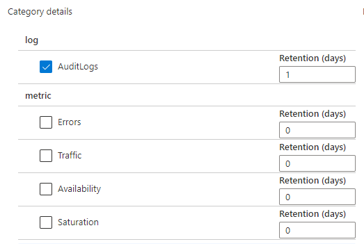

# Shoebox Design for IoT Logs

[[_TOC_]]

# Scenarios

1. A customer should be able to opt in to be able to view IoT Connector logs.

	If the customer opts in to collecting certain log categories for the Azure API for FHIR, they should also be able to see log categories for child resources like the IoT connector.

	Currently, Azure API for FHIR audit logging can be enabled by customers in Azure Monitor when they select the "AuditLogs" category as shown in the image below. In the future, diagnostic logs for the Azure API for FHIR can be enabled by selecting a new "DiagnoticLogs" category.

	

	For IoT diagnostics logs, we are proposing adding a new log category for the IoT Connector called "IoTDiagnosticsLogs". We are choosing to create a new log category because there may be different logging requirements and schema requirements between the IoT Connector and the Azure API for FHIR. In addition, having separate log categories allows a customer to easily organize logs and opt in to the logs that they would like to see. 

	Below are the specific IoT logs we will be creating with the "IoTDiagnosticsLogs" category
  	- Error
		- Connector is unhealthy (Stream Analytics job is behind)
		- Connector cannot connect to Azure API for FHIR (FHIR server health check failed)
	- Information
		- Connector is healthy (Stream Analytics job is up to date)
		- Connector can connect to Azure API for FHIR (FHIR server health check succeeded)

# Metrics
As mentioned in other designs we should be collecting the number of customers that have opted in to certain log categories.

# Design
### Logs

1. The IoT connector app will be updated to generate logs with a new log category of "IoTDiagnosticLogs"
2. The IoT connector app will also include the resourceId in the logs generated. This is a Shoebox requirement for routing logs to the correct location. In order to route the logs to the Azure API for FHIR, the resourceId of the Azure API for FHIR will be sent on logs emitted by the IoT Connector. The actual resourceId of the underlying IoT connector resources will also be sent for debugging purposes but will not be exposed to the customer.
3. The IoT Monitoring Agent configuration will be updated with a shoebox bloom filter and event streaming annotations to route logs to Shoebox.
4. The health-paas armManifests will be updated to include the new log category of "IoTDiagnosticLogs" so that the category will be available to customers.
5. We will complete the onboarding process with Log Analytics. 

Below is the ARM manifest change required in the various ./deployment/armManifests/*.json files. The "IoTDiagnosticLogs" category is added to the array of "onbehalfSupportedLogCategories".

```json
    "metadata": {
        "microsoft.insights": {
            "monitoringResourceProvider": {
                "version": "1.0",
                "apiVersions": {
                    "default": "2019-09-16",
                    "operations": "2019-09-16"
                },
                "logs": {
                    "mdsInfo": [
                        {
                            "serviceIdentity": "Microsoft.HealthcareApis",
                            "onbehalfSupportedLogCategories": [
                                "AuditLogs", "DiagnosticLogs", "IoTDiagnosticLogs"
                            ]
                        }
                    ]
                }
            }
        }
```  

This is the Log Analytics schema we plan to onboard.

|Field Name|Type|Notes|JSON path in Shoebox|
|---|---|---|---|
|TimeGenerated|DateTime|Required in all schemas|$.time|
|OperationName|String|Required in all schemas|$.operationName|
|CorrelationId|String|Required in all schemas|$.correlationId|
|Message|String|The log message.|$.message|
|Level|String|The log severity level.|$.level|
|ConnectorId|String|The full resourceId of the IoT Connector that emitted the log|$.properties.connectorId|
|ConnectorName|String|The name of the IoT Connector that emitted the log|$.properties.connectorName|
|LogCategory|String|The log category. We will emit ‘IoTDiagnosticLogs’ for the value.|$.category|
|Location|String|The location of the server that processed the request(e.g., South Central US)|$.location|
|Properties|Dynamic|Additional properties.|$.properties|

##### IoT Monitoring Agent Config changes

``` XML
<DerivedEvent eventName="AzureMonitorIoTDiagnosticShoeboxLogs" storeType="CentralBond" duration="PT1M" source="ShoeboxLogs" account="AuditStore">
        <Query>
          where logToCustomer == "true" && ApplyBloomFilter("SHOEBOX_BLOOM_FILTER", resourceId)
          select time, resourceId, operationName, category, resultType, resultSignature, message, durationMs, correlationId, level, location, uri, properties
        </Query>
</DerivedEvent>

…

<EventStreamingAnnotation name="^AzureMonitorIoTDiagnosticShoeboxLogs.*">
      <OnBehalf>
        <Content>
          <![CDATA[<Config
                     onBehalfFields="resourceId,category"
                     primaryPartitionField="resourceId"
                     containerSuffix="$category"
                     validJsonColumns="identity,properties"
                     excludeFields="TIMESTAMP"/>]]>
        </Content>
      </OnBehalf>
    </EventStreamingAnnotation>

```

# Test Strategy
- Logs
  - While there will be unit tests in our code, there will need to be some manual verification as described below.
  - We will test that logs are pushed to a new shoebox table that gets created in Geneva.
  - When the ARM manifest changes described in logs section of the design roll out to Production, and the LogAnalytics schema publication is completed, the new IoT log category should be available, and we should then be able to export IoT logs from a subscription.
  - Also test that Azure API for FHIR logs are working as expected and no regressions have occurred.
  
# Security
We are not logging any sensitive information and following existing logging processes.

# Open Questions
- (Resolute+IoT) Decide on technical strategy that determines which logs to expose and which logs not to expose to customers.
  - https://microsofthealth.visualstudio.com/Health/_git/health-paas-docs/pullrequest/13471

# Resoloved Questions
- (Shoebox) Can we use the Azure API for FHIR resourceId when emitting IoT logs in order to route the log to the Azure API for FHIR? Yes. 

# Shoebox documentation
- https://aka.ms/shoebox
- https://aka.ms/shoeboxlogs
- https://aka.ms/LARPOnboard