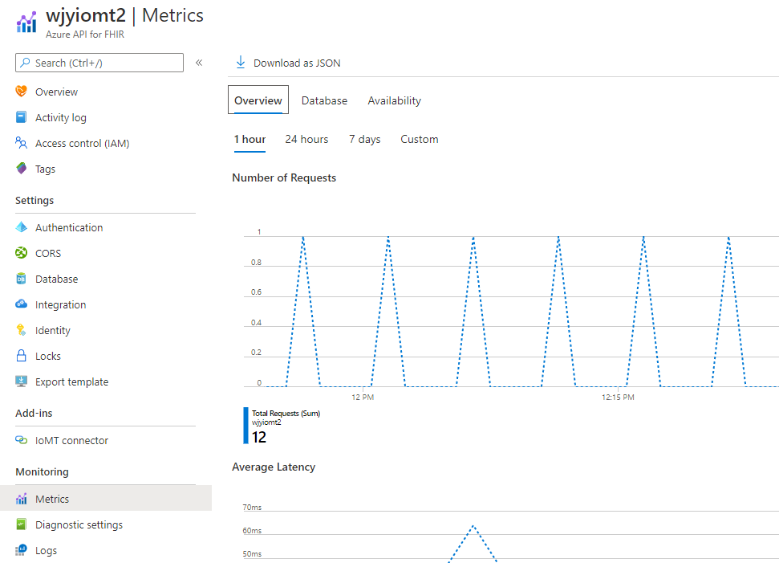
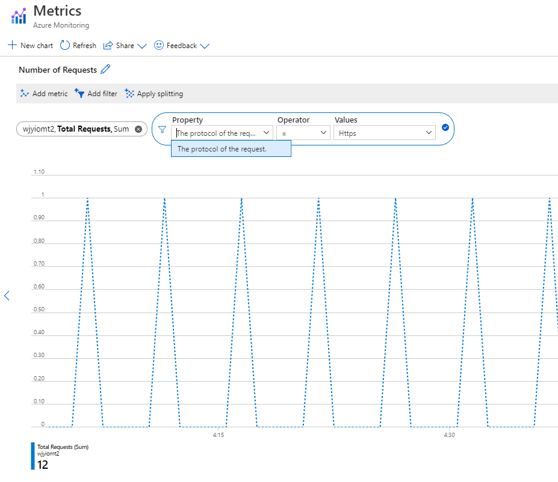

# Shoebox Design for IoT Metrics

[[_TOC_]]

# Scenarios
1. If the customer has provisioned an IoT Connector, we should also publish IoT Connector metrics under the Metrics blade. 

	Currently there are 3 tabs under the Metrics blade titled "Overview", "Database", and "Availability" as shown in the image below. We are proposing adding another tab called "IoT Connector" which would display metrics for the IoT Connector and the tab would only display if an IoT Connector has been provisioned.

	

	Under this new separate metrics tab, we are proposing displaying IoT metrics for Traffic, Latency, Availability, and Errors. 

	|Metric Category|Metric Name|Type|Notes|Dimension Name (ResourceId)| Dimension Name (ConnectorName)
	|---|---|---|---|---|
	|Traffic|IoTInputMessages|Long|Number of Input Messages|ResourceId|ConnectorName
	|Traffic|IoTNormalizedMessages|Long|Number of Normalized Messages|ResourceId|ConnectorName
	|Latency|IoTNormalizeStageLatency|Double|Average Normalize Stage Latency|ResourceId|ConnectorName
	|Latency|IoTGroupStageLatency|Double|Average Group Stage Latency|ResourceId|ConnectorName
	|Availability|IoTProcessingHealth|Long|Health status of the Stream Analytics watermark|ResourceId|ConnectorName
	|Availability|IoTConnectivityHealth|Long|Health status of IoT Connector to FHIR Server connectivity, and FHIR Server response|ResourceId|ConnectorName
	
    Error metrics will have a few more dimensions than the metrics mentioned above. This is not an exhaustive list, but should provide an idea of what errors and dimensions will be included as metrics.

	|Metric Category|Metric Name|Dimension Name (PipelineStage)|Dimension Name (ErrorCategory)|Dimension Name (ErrorName)|Dimension Name (Severity) | Dimension Name (ResourceId)
	|---|---|---|---|---|---|---|
	|Error|IoTError| Normalize | Device Template | Template not populated | Critical | ResourceId
    |Error|IoTError| Normalize | Device Template | Invalid template type | Critical | ResourceId
    |Error|IoTError| Normalize | Device Message | Unsupported message format | Error | ResourceId
    |Error|IoTError| Normalize | Device Message | Required value missing | Error | ResourceId
    |Error|IoTError| Normalize | System Error | * | Error | ResourceId
    |Error|IoTError| Transform | FHIR Conversion | Patient Id not present in message to create Patient resource | Error | ResourceId
    |Error|IoTError| Transform | FHIR Resource | Patient resource not available | Error | ResourceId
    |Error|IoTError| Transform | FHIR Server | Throttling from FHIR Server | Critical | ResourceId

# Metrics
As mentioned in other designs we should be collecting the number of customers that have opted into certain log/metrics categories.

# Design
### Metrics
The implementation for customer available metrics will be broken up into two phases. The first phase will focus on getting metrics flowing through shoebox, and available to be exported by customers. The second phase will focus on the UI presentation of the metrics in the Azure Portal (displaying graphs, charts, counts, etc).

##### Backend/Administrative (Phase 1)
In order for metrics to appear in the customer's subscription, the following steps will need to be taken:

- Complete onboarding process with ShoeboxCore
    - Create Regional Shoebox2 MDM accounts for IoT Connector (MicrosoftHealthcareApisIoTShoeboxWestUs2) 
	- MDM account metrics enriched such that they include the subscription/resource group/resource type/resource id
    - For each metric, upload the metric definition to each MDM account.
    - Operations API change to add new IoT metrics [ShoeboxMetricsProperties.json](https://microsofthealth.visualstudio.com/Health/_git/health-paas?path=%2Fsrc%2FResourceProviderApplication%2FARMResourceProvider.Service%2FOperations%2FShoebox%2FShoeboxMetricsProperties.json&_a=contents&version=GBmaster)
    - Arm Manifest change not required.
- Update IoT function app to emit metrics with dimensions outlined in the table above.

For the Operations API change (ShoeboxMetricsProperties.json) we will add metrics to the metricSpecifications array.

##### Total IoT Errors
```json
{
    "name": "IoTTotalErrors",
    "displayName": "Total IoT Connector Errors",
    "displayDescription": "The total number of IoT Connector errors encountered by the service.",
    "unit": "Count",
    "aggregationType": "Sum",
    "dimensions": [
        {
            "name": "PipelineStage",
            "displayName": "The stage of the IoT connector pipeline where the error occurred"
        },
        {
            "name": "ErrorCategory",
            "displayName": "The error category."
        },
        {
            "name": "ErrorName",
            "displayName": "The display name of the error."
        },
        {
            "name": "Severity",
            "displayName": "The severity of the error."
        },
        {
            "name": "ConnectorName",
            "displayName": "The name of the IoT Connector that generated the error."
        },
    ],
    "fillGapWithZero": false,
    "category": "Errors"
}
```

##### IoT Transactions
```json
{
    "name": "IoTTotalTransactions",
    "displayName": "Total IoT Connector Transactions",
    "displayDescription": "The total number of IoT Connector transactions",
    "unit": "Count",
    "aggregationType": "Sum",
    "dimensions": [
        {
            "name": "PipelineStage",
            "displayName": "The stage of the IoT connector pipeline where the transaction occurred"
        },
        {
            "name": "ConnectorName",
            "displayName": "The name of the IoT Connector that generated the transaction."
        },
    ],
    "fillGapWithZero": false,
    "category": "Traffic"
}
```

##### IoT Latency
```json
{
    "name": "IoTLatency",
    "displayName": "Average IoT Connector transaction latency",
    "displayDescription": "The average latency of IoT Connector transactions",
    "unit": "Milliseconds",
    "aggregationType": "Average",
    "dimensions": [
        {
            "name": "PipelineStage",
            "displayName": "The stage of the IoT connector pipeline where the transaction occurred"
        },
        {
            "name": "ConnectorName",
            "displayName": "The name of the IoT Connector."
        },
    ],
    "fillGapWithZero": false,
    "category": "Latency"
}
```

TBD Availability

##### Portal UI (Phase 2)
There are also Azure Portal changes required. Currently under the Metrics blade, there are 3 metrics tabs ("Overview", "Database", and "Availability"). In this design we are proposing adding a new tab which IoT Connector metrics will display under. 

The health-paas-portal metrics code will need to be enhanced. Specifically, MetricsSection.ts will be modified to create a new tab for IoT Connector metrics, and some additional modifications will be made to display the metrics/graphs/counts.

In order to display useful metrics, it would be helpful to be able to filter metrics on a given IoT connector. In the metrics we record we will be including a dimension for the connector name so that the customer can easily filter on metrics emitted by a given IoT connector. 

The filtering would be similar to the way that the Azure API for FHIR has a "Total Requests" metric which has a dimension named "The protocol of the request". The user can specify a dimension value where protocol is "Https" as shown below.


For the IoT metrics, we are proposing including a dimension named "ConnectorName" so that the user can filter metrics graphs/charts based on a given connector name, which would be the dimension value.

We will hide the IoT Connector metrics changes behind a feature flag so that we can roll out to an environment like TiP and validate our changes.

# Test Strategy
- Metrics Phase 1
  - The metrics should be flowing to the appropriate MDM account in Geneva.
  - When the Operations API for our RP has been published and rolled out, metrics should then be available for export.
  - We should also test that Azure API for FHIR metrics are working as expected and no regressions have occurred.
- Metrics Phase 2
  - Given that the metrics from Phase 1 are rolled out, we will have a feature flag that enables/disables all the new IoT metrics portal changes. We will roll out the portal changes behind a feature flag to TiP and validate the portal UI changes.
  - UI unit tests will also be written.
  
# Security
We are not emitting any sensitive metrics and following existing metrics processes.

# Open Questions
- (Shoebox) What ultimately controls what metrics are available to customers? (Metrics operation API?)
- (Resolute) What does ShoeboxMetricsProperties.json do? (does it control whether metrics are available to customers? any special considerations for modifying this file and rolling out?)
- (Azure) On the Diagnostic Settings page, does the portal support support different sections besides just "log" and "metric"? It would be nice to have Azure API for FHIR metrics under a separate section from IoT Connector metrics.

# Resolved Questions
- (Geneva) How do we route to multiple MDM accounts with our Monitoring Agent? Does a Geneva namespace have to be associated with a metrics account in order to send metrics to the MDM account?
  - The same cert that is used by the Monitoring Agent to connect to the logs accounts needs to be associated with the metrics MDM accounts. Then when instrumenting the code we can specify whichever metrics account and namespace we want, and metrics will be emitted to either or both.