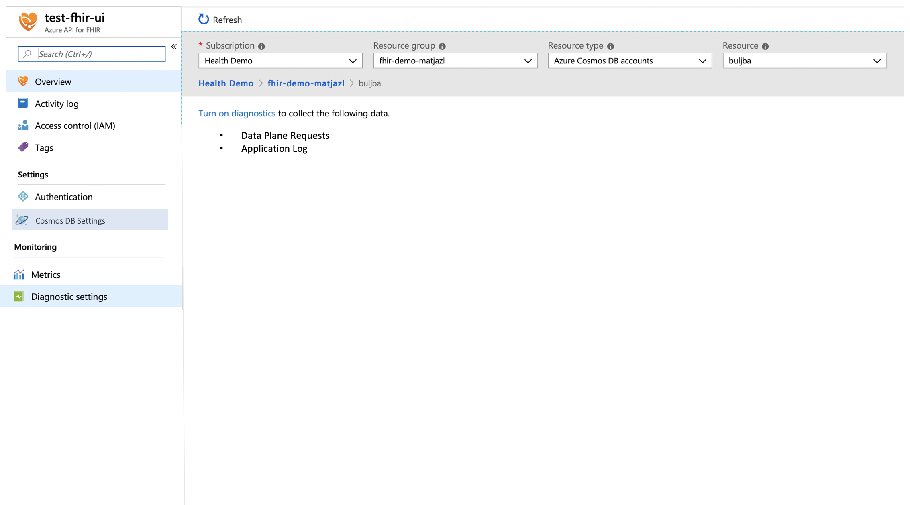
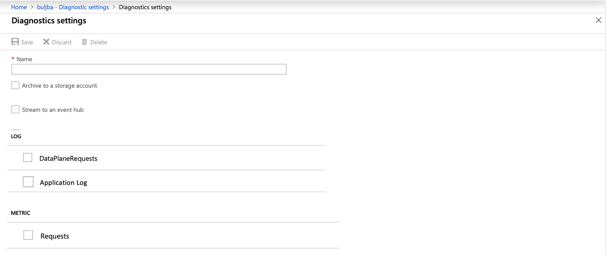

# Metrics and Diagnostic Logs - Shoebox onboarding

For customers to monitor the service, we need to surface diagnostic logs. These are various system and security logs and metrics from the service that customers can pipe into their Storage Account, Stream to event hub or send to Log Analytics

[[_TOC_]]

# Business Justification

Access to Metrics and diagnostics logs are core requirement by any customer in order to use any cloud service. This gives customers confidence on how service performs and monitoring of any configuration changes and access to the service. Also as a healthcare service we fall under strict security and compliancy requirements (HIPAA) and need to provide customers insight into performance, availability and security of the service

# Scenarios

* Diagnostics logs:
    + Security Logs (Data plane): - P1
        - CRUD operations on the service (Read, Write, Update, Delete)
    + Application Logs:
        - Critical, Error, Warning, Information - P1

# Metrics

N/A

# Design

## Diagnostics Log

# Test Strategy

*Describe the test strategy.*

# Security

NA

# Other

* Content will need to be localized as per Azure requirements.
