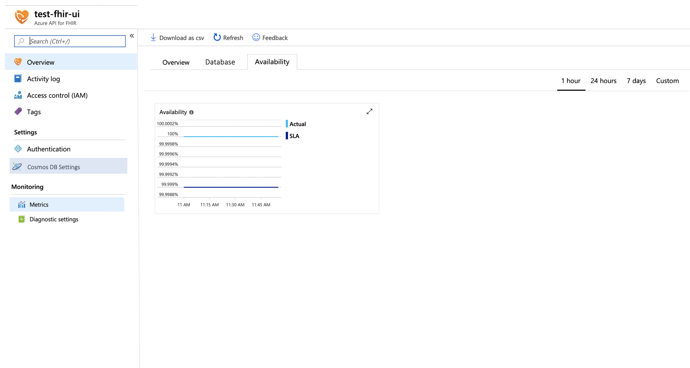

# Shoebox - Metrics onboarding

For customers to monitor the service, we need to surface different metrics. These are various metrics that we can show on Metrics dashboard, where customer can see the performance of the service, size of the database etc (see Scenarios)

[[_TOC_]]

# Business Justification

Access to Metrics and diagnostics logs are core requirement by any customer in order to use any cloud service. This gives customers confidence on how service performs and monitoring of any configuration changes and access to the service. Also as a healthcare service we fall under strict security and compliancy requirements (HIPAA) and need to provide customers insight into performance, availability and security of the service

# Scenarios

* Metrics
	+ Overview
        - Number of API Calls (Total, per second) - (averaged over a minute) - P1
        - Statistic over what operations were performed on FHIR - P2
        - Status Code returned for operations - P2
        - CPU time, Memory working set and number of connections to the service - P1
	+ Database
		- Cosmos DB Average throughput RU/s) - averaged over a minute
        - Cosmos DB Database Size in B - P1
        - Cosmos DB Index Size in B - P2
        - Cosmos DB Number of requests exceeded capacity (aggregated over 1 minute interval) - Http 429 - P1
	+ Availability
        - Availabiliy of the service against defined [SLA](../roadmap/SLA.md#introduction) - P2

# Metrics

N/A

# Design

Metrics will be exposed in Azure portal under Monitoring section, initially showing basic statistics of Azure API for FHIR service and underlying database (Cosmos DB). There will be three tabs showing the metrics of the service

* Overview
* Database
* Availability

## Data Collection

Different types of metrics have several different options for how they can be collected, each with their own pros and cons.

* Database metrics:
    + From within the FHIR service. We would have to insert calls at the right points in the code to measure the metrics, but it gives us more flexibility. For example, we could correlate RU usage to specific actions such as get, create, or search, if we wanted to.
    + From the underlying Cosmos DB account's metrics endpoint. This would add a delay, is limited to the granularity provided by Cosmos DB, and does not give us flexibility to output RU usage based on the type of API call. This would also have additional infrastructure work to set up querying for metrics data which would be more complex.
* System metrics (CPU, memory) could be collected in several ways:
    + From within the FHIR service. The downside would be that it would be counted towards part of the customer's allotted resources, and that it could be delayed (or not emitted altogether) if the customer causes their service to be pegged at maximum resources.
    + From the Cluster Agent. This would provide a central place for querying this data, but it could hit some scaling issues depending on how many instances of FHIR services exist on that node. We would also need to make sure that the Cluster Agent has the necessary permissions to read other process' performance data. This could read the metrics using either the Process class or using Performance Counters. Performance counters are less discoverable as we would have to take several steps to associate the process ID with the right account.
    + From a separate process started by the FHIR service. This makes it easy to emit data for the right account, since the child process can be directly told which process to measure and the resource ID it is associated with, but it would have the additional overhead of a process per FHIR service instance.
* API metrics could be collected from different sources:
    + From within the FHIR service. We would have to insert calls to output metrics data at the right spots in the FHIR service code. This makes it easy to control which API calls should be measured, but it would not emit data if the FHIR service is down altogether.
    + From the front end service. This makes it easy to output results for every call to the FHIR service, and it would handle the case where the FHIR service is down altogether, but it would miss logging failures for when the front end itself is down. It also makes it more difficult to control which actions are tracked, and to segregate the data based on which API is being called. This would end up including health check calls.
    + From the metrics data of the traffic manager profile associated with the FHIR service. This takes care of outputting data if there are issues with the front end service or the FHIR service. But it makes it more difficult to control which actions are tracked, and to segregate the data based on which API is being called. Plus it has the overhead of needing to build infrastructure to query this information from metrics, and a delay.

### Database metrics
For database metrics, we will collect them from within the FHIR service itself, as it gives us more flexibility while being simpler to implement.

### System metrics
For system metrics, we will start by implementing it in the cluster agent. We can measure the performance of this specifically to keep track of any delays in collecting metrics for a FHIR service, and if necessary switch it to a separate process per FHIR service.

### API Metrics
We will use a hybrid of collecting metrics from within the FHIR service and from the front end service. Most metrics will be collected from the FHIR service, but metrics around the FHIR service being unreachable (HTTP status codes 502 & 503) will be collected from the Front end service.

An abstraction layer will be created in the FHIR service code base for outputting metrics, using an IMetricLogger interface. This will take in a metric name, dimensions, and a value for that metric. This can also take in a channel name, which we can use to filter which events we emit or ignore to Shoebox in the PaaS implementation. To start with, we can have a NullMetricLogger implementation in the FHIR service that does nothing. This can be used in spots where metrics need to be logged to emit these metrics. This can be injected into the storage layers, and into an API metrics middleware, to be used for emitting database and API metrics.

 In PaaS, we will have an implementation of IMetricLogger that will output metrics using IFX. This layer will need to also take in an account name, namespace, and a resource ID that will be used to output the metric to the right Geneva Metrics account and associate the metric with the correct customer's FHIR resource ID.

A separate but similar layer will need to be implemented in the Cluster Agent service that will collect system metrics for all FHIR service instances running on that node, and then emit metrics to Geneva Metrics using the correct account for that region, and mapping the FHIR service instance to the correct customer's Resource ID. Similarly, this same layer can be used by the Front end service to track 502 and 503 error metrics when routing to a specific customer's FHIR service.

Based on that, we will roughly have:

* Microsoft.Health.Fhir.Core.Features.Metrics.IMetricLogger
* Microsoft.Health.Fhir.Core.Features.Metrics.NullMetricLogger : IMetricLogger
* Microsoft.Health.Fhir.Api.Features.Metrics.MetricMiddleware
* Microsoft.Health.Cloud.ServicePlatform.IfxMetricLogger
* Microsoft.Health.Fhir.Cloud.FhirService.Features.Metrics.MetricLogger : IMetricLogger

# Test Strategy

We will use unit tests where appropriate. We can also use integration tests for verifying that metrics are being emitted to our Metrics accounts.

A full E2E test to ensure that metrics show up in a customer's account is more complicated, due to the fact that the Shoebox team uses a fake region (Brazil US) for testing in production, and does not have any infrastructure deployed in Dogfood. The design for this will be done as part of [User Story 69496: Plan for using "Brazil US" in test/rel/canary](https://microsofthealth.visualstudio.com/Health/_workitems/edit/69496)

# Security

There are certificates associated with the metrics account which are used to allow the monitoring agent to upload data to that account. We can leverage our existing infrastructure for securing certificates in KeyVault and rotating them as needed.

We should ensure that we have a test that verifies that the correct resource ID of a customer's FHIR service is emitted in the metric.

# Other

* Content will need to be localized as per Azure requirements.
