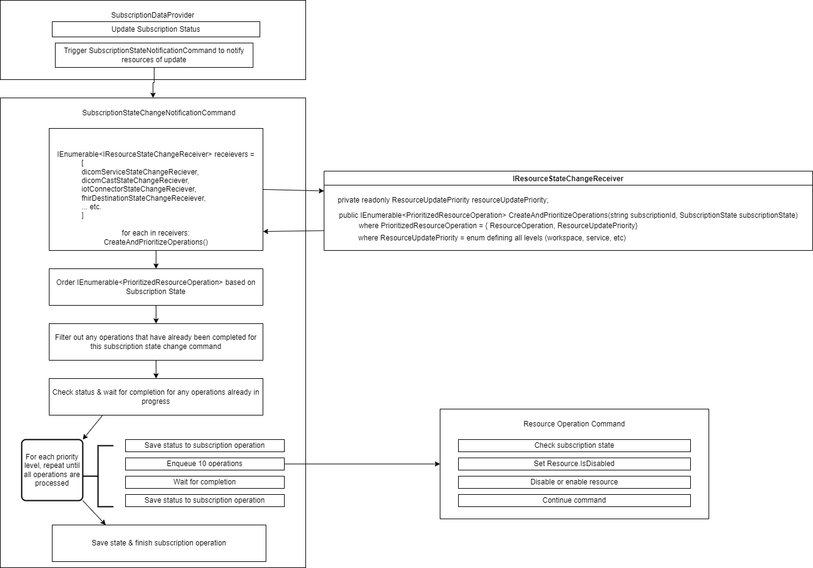

# Subscription state change spec updates



## P0 - Trigger new operations for each resource via SubscriptionStateChangeNotificationCommand

## Goals

- Ensure reliable subscription state change operation execution
- Resources are modified in correct dependency order
- Save the state of the operation execution, so no work is repeated on retries and errors can be easily investigated

### Why are these changes needed?

The current implementation's structure is not ideal for complex updates that are needed for resources like dicom & iot.

Issues observed:
- No tracking if resources have been updated or not. The resource's `ProvisioningState` is immediately set to the subscription state, so resources that failed to complete Notify() would look the same as those that succeeded Notify()
- Order of resources updated is not defined, which could result in resources with dependencies being left in a bad state. For example, DICOM Cast would start throwing errors if it's linked FHIR Service was deleted before it was.
- There is immediate failure if any resources are active, which could result in more retries than necessary and repetition of work
- Delete operations for each resources are executed all at once, which has the potential to overwhelm the RP for that region
- Subscription state change operation will retry indefinitely (via isIdempotent flag) which will cause problems if we have any failures that cannot be fixed by retries. 
- Subscription state change operation inherits from ResourceOperation. ResourceOperation is meant to target a single resource, while this operation targets many

### Proposed changes:

`SubscriptionStateChangeNotificationCommand`
1. Ask each resource for a list of operations that it needs to do & that operation's priority
    - ex: subscriptionState = `Deleted`
      - workspace creates a `Deprovision` operation for each workspace, and gives it priority 0
      - dicom service creates a `Deprovision` operation for each service, and gives it priority 1
      - dicom cast creates a `Deprovision` operation for each service, and gives it priority 2
2. Orders execution of operations based on priority & the subscription state
    - ex: subscriptionState = `Deleted`
      - will execute operations of the highest priority first (child resources like dicom cast)
    - ex: subscriptionState = `Registered`
      - will execute operation of the lowest priority first (top-level resources like workspace)
3. As the operations are enqueued to execute, save their metadata to a new `ResourceOperationManager` document in the global db
    - also check this document to ensure we have not already triggered operations for any resources, skip or monitor them if we have
4. Queue the operations in batches of 10 to avoid overwhelming a region, and only start the next priority level once the previous level has completed
5. Save the completed operation's state, and exit the `SubscriptionStateChangeNotificationCommand` once all operations have completed

This design assumes that each resource's queued operation will drive the resource to the desired state.

### Rough overview of changes to existing operation models & new proposed models:

See [Proposed document models](./subscriptionStateChangeUpdates-models.md) doc. 

#### Pros:
- Maintainability: All "update" operations to resources can be done through the same code path
- Reduce redundancy: Operations have built-in retries, checks for active operations, so we don't need to add that in the `SubscriptionStateChangeNotificationCommand`
- Resiliency: Keeps track of state through retries via operation document
- Scalable: Operations are scalable and can be run in parallel, so this reduces the risk for large subscriptions

#### Cons:
- If there's an existing operation for the resource in progress, we will need to wait until that is done to start this one. However, that is preferable to failing if there is an operation in progress, which is what happens today.
- Have to do some unnecessary waiting; we wait for all resources at a priority level (ex: dicom cast) before moving onto the next level's resources (ex: iot connector) even though not all are dependent on the previous level's resources completing. This is a minor trade-off for a simple way to handle resource dependencies.

#### Keep in mind:
- Cosmos DB document limit is 2 MB

### Work needed:
 - Update existing operation structure
   - Make base `IOperation` not specific to an individual resource
   - Create new classes for a new type of operation that allows us to act on multiple resources at once & keep track of status
 - Create method to prioritize operations and limit execution so only a certain # of operations are running at once
 - Each service / resource type needs to create handler to create and prioritize resource operations
 - Update `SubscriptionStateChangeNotificationCommand` with new logic

## P1 - Don't save subscription state on ResourceObject's provisioning state

### Why are these changes needed

1. We should avoid having developers keep understand and keep track of many different values for provisioning state, since it invites bugs. There is already a bug where EventGrid cannot delete Events due to the Warned/Suspended state. 
Instead each resource can simply check the subscription to see what state it is in.
2. A resource's update operation should be able to drive the resource to the correct desired state, not wait for information from another operation. 

### Proposed changes:

1. Add a new field to ResourceObject called `isDisabled` to track the resource's state, so we can easily check whether or not the subscription state change has been applied.

2. Each resource provisioning command should:
   - inject subscription context
   - check the subscription status for suspended/warned/registered and then take the appropriate action

Example of changes in BaseWorkspaceCommand.cs:

```
public BaseWorkspaceCommand(
    ...
    ISubscriptionReadRepository subscriptionReadRepository,
    ILogger logger)
{
    ...
    SubscriptionReadRepository = EnsureArg.IsNotNull(subscriptionReadRepository, nameof(subscriptionReadRepository));
}

protected ISubscriptionReadRepository SubscriptionReadRepository { get; private set; }

...

protected async Task<bool> ShouldResourceBeDisabledBasedOnSubscriptionState(IResourceIdentity resourceIdentity, CancellationToken cancellationToken)
{
    var documentId = SubscriptionEntity.CreateId(resourceIdentity.ProviderNamespace, resourceIdentity.SubscriptionId);
    var subscriptionInfo = await SubscriptionReadRepository.ReadSubscriptionAsync(documentId, resourceIdentity.SubscriptionId, cancellationToken);

    if (subscriptionInfo.State == SubscriptionState.Suspended || subscriptionInfo.State == SubscriptionState.Warned)
    {
        return true;
    }
    else
    {
        return false;
    }
}
```

Example: being applied in an inheriting provisioning command (DicomServiceProvisioningCommand.cs):
```
protected override async Task ExecuteOperationAsync(DicomServiceOperation operation, CancellationToken overallCancellationToken, CancellationToken retryableCancellationToken)
{
    ...

    // set on resource document
    dicomServiceResourceDocument.Resource.IsDisabled = await ShouldResourceBeDisabledBasedOnSubscriptionState(dicomIdentity, overallCancellationToken);

    ...

    // apply changes to k8s
    dicomServiceSpec.isDisabled = dicomServiceResourceDocument.Resource.IsDisabled;
    _dicomK8sProvisioningProvider.ProvisionAsync(dicomServiceSpec, cancellationToken);
}

```

FHIR implementation:
- Currently, the front end service will disable FHIR based on the ProvisioningState of the resource. This can switch to use the susbcription's state

#### Pros:

- keeps resource's ProvisioningState simple, not overloaded
- ensures that all subsequent updates (ex: reprovisioning) to the resource will handle subscription state

#### Cons:
- Introduces more complexities in each operation. Every operation will need to be updated to consider the subscription state change, and future operations created will need to remember to include it as well. How can we force this to be used for every operation?

### Work needed:
- Each service will need to update their provisioning command
- FHIR will need to update the front end to detect if the service is suspended/warned via the subscription's state
- Update ARM to disable PUT/PATCH/POST calls on resources based on subscription state
- Update Billing to disable resource's billing based on subscription state


## Future improvements

1) Cascading deletes. Deleting a workspace should delete everything inside that workspace instead of having to work backward and delete the children first. 
