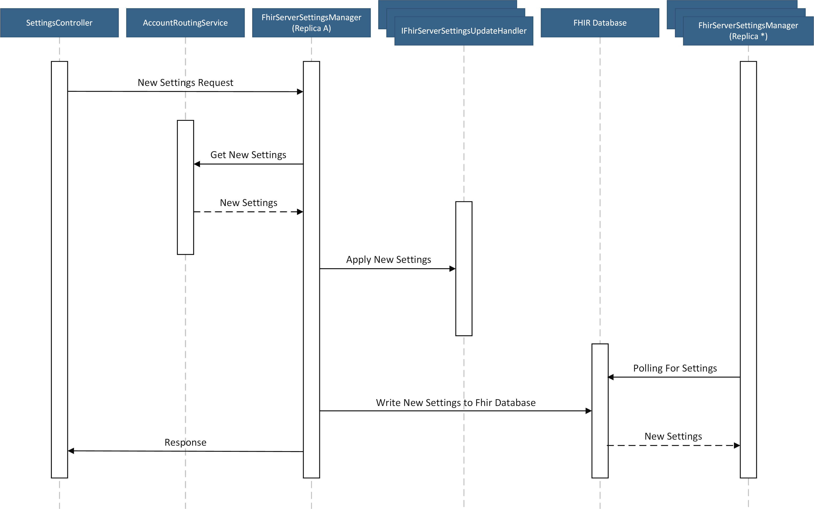

This document outlines how properties of the FhirApplication are updated without re-provisioning or restarting.

This document includes design details to relating the FhirApplication only. Design details for the AccountRoutingService can be found [here](AccountRoutingService.md) and details regarding the ResourceProviderWorker can be found [here](ResourceProviderWorker.md).

[[_TOC_]]

# Business Justification

As outlined in the [Updating-Resource-Properties](../Updating-Resource-Properties.md) document, updating properties like Authentication/Authorization settings and CORS requires re-provisioning every Azure resource that backs the API for FHIR. The ability to update some properties without re-provisioning resources will greatly improve the user experience.

# Metrics

We will track:

1. Requests made to the "internal" endpoint, the duration and result of the requests.
2. Polling events that occur when replicas are looking to updates and any errors that occur.
3. When replicas update based on changes to the 'settings' document in the db.

# Design

## Overview

1. The SettingsController receives a POST request to update the Fhir Server Settings with an operation document id and forwards it to the FhirServerSettingsManager.

2. The FhirServerSettingsManager sends a GET request to the AccountRoutingService to fetch the FhirServerSettings using the operation document id (the operation document id is a unique id for an operation stored in the Global db).

3. The FhirServerSettingsManager delegates handing updates to a collection of IFhirServerSettingsUpdateHandlers.

4. It is the responsibility of the IFhirServerSettingsUpdateHandlers to extract the relevant settings from the FhirServerSettings object and apply them as needed.

5. Once all the handlers have successfully applied the new settings, a new FhirServerSettingsDocument will be written to the FHIR Database (Account specific Cosmos DB).

6. The FhirServerSettingsManager will provide a result back to the SettingsController (success or exception).

7. The FhirServerSettingsManager in other replicas are polling for changes to the FhirServerSettingsDocument and will apply the updated settings.



## Detailed Design

### Authentication Routing

To validate incoming tokens, the Authentication settings are overridden in the StartupBase.cs class to support the use of an AuthenticationRouter.  There will always be 3 schemes added:

* SelectorScheme - This scheme is used to forward an incoming request to the correct handler.
* WorkerScheme - This scheme is used to allow the ResourceProviderWorker access to the settings endpoint.
* FallbackScheme - This scheme will always fail to prevent access for tokens that contain an unknown issuer.  

*Code added to StartupBase.cs to override existing Authentication settings.*

```c#
services.AddAuthentication(options =>
{
    // Change the authentication defaults to use the SelectorScheme.
    // This will cause the Authority/Audience to be evaluated when a request comes in.
    options.DefaultAuthenticateScheme = AuthenticationRouter.SelectorScheme;
    options.DefaultChallengeScheme = AuthenticationRouter.SelectorScheme;
    options.DefaultScheme = AuthenticationRouter.SelectorScheme;
})
.AddPolicyScheme(AuthenticationRouter.SelectorScheme, AuthenticationRouter.SelectorScheme, AuthenticationRouter.SelectorSchemeOptions)
.AddJwtBearer(AuthenticationRouter.WorkerScheme, options =>
{
    // Add the WorkerScheme to provide an authentication path for the ResourceProviderWorker.
    options.Authority = serviceEnvironment.ResourceProviderWorkerAuthority;
    options.Audience = serviceEnvironment.ResourceProviderWorkerAudience;
    options.RequireHttpsMetadata = true;
    options.Challenge = $"Bearer authorization_uri=\"{serviceEnvironment.ResourceProviderWorkerAuthority}\", resource_id=\"{serviceEnvironment.ResourceProviderWorkerAudience}\", realm=\"{serviceEnvironment.ResourceProviderWorkerAudience}\"";
})
.AddJwtBearer(AuthenticationRouter.FallbackScheme, options => { /*FallbackScheme options are empty so all unmapped requests will fail.*/ });

AuthenticationRouter.IssuerToSchemeMap.Add(AuthenticationRouter.WorkerScheme, serviceEnvironment.ResourceProviderWorkerIssuer);
```

```c#
public static class AuthenticationRouter
{
    /// <summary>
    /// The name of the authentication scheme used to route the request to the appropriate handler.
    /// </summary>
    public static string SelectorScheme => "SelectorScheme";

    /// <summary>
    /// The name of the authentication scheme used to validate the token form the RPWorker.
    /// </summary>
    public static string WorkerScheme => "WorkerScheme";

    /// <summary>
    /// The name of a scheme used if an incoming issuer claim is not mapped.
    /// </summary>
    public static string FallbackScheme => "FallbackScheme";

    /// <summary>
    /// A dictionary containing a mapping of bearer token issuer claims to AuthenticationSchemes.
    /// Used to route incoming requests to an appropriate token handler based on the issuer claim.
    /// </summary>
    public static IDictionary<string, string> IssuerToSchemeMap { get; } = new Dictionary<string, string>();

    /// <summary>
    /// Scheme options that evaluate the token on an incoming request and route the authentication handling to the appropriate handler
    /// based on the issuer claim.
    /// </summary>
    public static Action<PolicySchemeOptions> SelectorSchemeOptions => new Action<PolicySchemeOptions>(options =>
    {
        options.ForwardDefaultSelector = context =>
        {
            var authorization = context.Request.Headers["Authorization"].ToString();

            // If no authorization header found, nothing to process further
            if (string.IsNullOrEmpty(authorization))
            {
                return FallbackScheme;
            }

            if (authorization.StartsWith("Bearer ", StringComparison.OrdinalIgnoreCase))
            {
                var handler = new JwtSecurityTokenHandler();
                var token = authorization.Substring("Bearer ".Length).Trim();
                var jwtToken = handler.ReadJwtToken(token);
                if (IssuerToSchemeMap.TryGetValue(jwtToken.Issuer, out string scheme))
                {
                    return scheme;
                }
            }

            return FallbackScheme;
        };
    });
}
```

### Authorization

Allowed Object Ids can be looked up using the issuer claim in the token.

```c#
public interface IFhirServerAuthorizationSettingsProvider
{
    HashSet<string> AllowedObjectIds(string issuer);
}
```

### Settings endpoint authorization

To ensure that the ResourceProviderWorker is the only actor that can access the settings endpoint, an an authorization filter will be created to evaluate token claims to ensure the caller is the ResourceProviderWorker.

### Interfaces

IFhirServerSettingsManager handles settings related operations:

1. Handles request updates sent to the Settings Controller.

2. Polls the FHIR Database for the settings document and will initiate updates when required.

3. If the application is restarted, it will populate settings that were saved to the FHIR Database.

```c#
public interface IFhirServerSettingsManager
{
    /// <summary>
    /// The current settings applied to the FHIR Server.
    /// </summary>
    FhirServerSettings Settings { get; }

    /// <summary>
    /// Handles requests to update FHIR Server settings.
    /// </summary>
    /// <param name="documentId">The document id of a settings document in the Global db.</param>
    /// <param name="subscriptionId">The subscription id (used as a partition key) for the settings document.</param>
    /// <param name="cancellationToken">A cancellation token.</param>
    Task ProcessSettingsUpdateRequest(string subscriptionId, string documentId, CancellationToken cancellationToken);
}
```

IFhirServerSettingsUpdateHandlers extract settings relevant to there specific domain and apply them as needed.

```c#
public interface IFhirServerSettingsUpdateHandler
{
    /// <summary>
    /// Handles updates to FHIR Server settings.
    /// It is the responsibility of the IFhirServerSettingsUpdateHandlers to extract the relevant settings from the FhirServerSettings object and apply them as needed.
    /// </summary>
    /// <param name="settings">An object representing the settings that need to be updated.</param>
    /// <param name="cancellationToken">A cancellation token</param>
    Task HandleUpdate(FhirServerSettings settings, CancellationToken cancellationToken);
}
```

### FhirServerSettings Classes

```c#
public class FhirServerSettings
{
    /// <summary>
    /// The time the settings object was created.
    /// This is used to determine whether or not settings need to be updated,
    /// the FHIRServerSettingsManager will always apply settings that are newer.
    /// </summary>
    [JsonProperty("creationTime")]
    public DateTimeOffset CreationTime { get; set; }

    /// <summary>
    /// An object containing both Authentication and Authorization related settings.
    /// </summary>
    [JsonProperty("authSettings")]
    public FhirServerAuthSettings AuthSettings { get; set; }
}
```

```c#
 public class FhirServerAuthSettings
{
    /// <summary>
    /// Authentication and Authorization settings provided by the customer.
    /// </summary>
    [JsonProperty("externalAuthSettings")]
    public IEnumerable<FhirServerAuthSetting> ExternalAuthSettings { get; set; }

    /// <summary>
    /// First party Authentication and Authorization settings (e.g IoMT Connector, ResourceProvideWorker, etc.).
    /// </summary>
    [JsonProperty("internalAuthSettings")]
    public IEnumerable<FhirServerAuthSetting> InternalAuthSettings { get; set; }
    }
```

```c#
public class FhirServerAuthSetting
{
    /// <summary>
    /// The authority used to validate incoming bearer tokens.
    /// </summary>
    [JsonProperty("authority")]
    public string Authority { get; set; }

    /// <summary>
    /// The audience used to validate incoming bearer tokens.
    /// </summary>
    [JsonProperty("audience")]
    public string Audience { get; set; }

    /// <summary>
    /// The object ids of objects that are allowed access to the FHIR Server.
    /// </summary>
    [JsonProperty("allowedObjectIds")]
    public HashSet<string> AllowedObjectIds { get; set; }
}
```

### FhirServerSettingsDocument

The document stored in both the Global db and the FHIR Database is FhirServerSettingsDocument. The FhirServerSettings will be serialized and saved as a string and the CreationTime and SchemaVersion properties will be exposed on the document so FhirServerSettings serialization can be deferred until after the document has been retrieved.

```c#
public class FhirServerSettingsDocument : DocumentModel<string>
{
    public FhirServerSettingsDocument(FhirServerSettings settings)
    {
        Id = FhirServerSettingsId;
        CreationTime = settings.CreationTime;
        Settings = JsonConvert.SerializeObject(settings);
    }

    public static string FhirServerSettingsId => "__fhirserversettings__";

    public override string PartitionKey => FhirServerSettingsId;

    /// <summary>
    /// A Boolean used in the FHIR Database to identify system documents.
    /// </summary>
    [JsonProperty("isSystem")]
    public bool IsSystem { get; } = true;

    /// <summary>
    /// The time that the FhirServerSettings object was created.
    /// </summary>
    [JsonProperty("creationTime")]
    public DateTimeOffset CreationTime { get; }

    /// <summary>
    /// A serialized settings object.
    /// </summary>
    [JsonProperty("settings")]
    public string Settings { get; set; }
}
```

# Test Strategy

Unit testing:

* FhirServerSettingsManager
* FhirServerSettingsClient
* FhirServerAuthorizationSettingsProvider
* FhirServerAuthenticationSettingsUpdateHandler
* AuthenticationSchemeManager

e2e testing:

1. Provision a test account
2. Verify settings request from RP Worker receives a 200
3. Verify test account cannot access the settings endpoint

# Security

The key security principle that we adhere to here is ensuring that each service has access to no more information than it requires, and should never be able to access settings or data belonging to another service. An Authority, Audience and Oid will be added to the Authentication settings granting the ResourceProviderWorker access to the settings endpoint only. The Authentication/Authorization path for the ResourceProviderWorker is outside of the path that ExternalAuthSettings and InternalAuthSettings follow; this is to ensure that requests to the settings endpoint will work regardless of FhirServerSettings.
