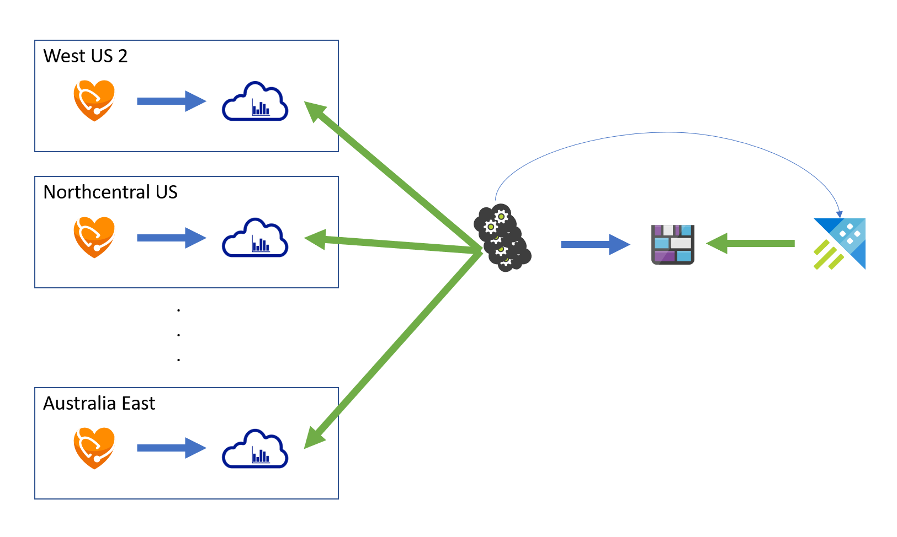

Build a prototype of system where we can run query to derive business intelligence against historical and current data. Explorer various potential ways to build the system.

More detail about the requirements can be found [here](https://microsofthealth.visualstudio.com/Health/_git/health-paas-docs/pullrequest/11466?_a=files&path=%2Fspecs%2FBusinessOpsPerformanceTracking.md).

Some of the requirements are:

- Both current and historical data can be queried.
- Data can be refreshed at least once a day.
- Data can be analyzed with minimum time granularity of one day.

[[_TOC_]]

# Business Justification

As we expand our service, it is critical to analyze the customer usage and feature adoption, as well as monitor our growth and trends. We have data collected in various ways from different systems; ideally, we will have one place where the data can be correlated and analyzed.

## Goals

1. Build a prototype to see how we can store smaller set of telemetry data to derive business values.
1. Explore building the process using new methods (e.g., serverless architecture).
1. Build a prototype that works E2E (from ingesting data to visualizing the data).

# Scenarios

* Enable deriving business intelligence and insights from histrocial data.

# Metrics

*List the metrics/telemetry that should be collected. For example: number of accounts that use feature X, number of requests to Y API per hour/day/week. How do we measure the success of this feature?*

# Glossaries

| Term | Description |
|------|-------------|
|[Azure Data Explorer](https://azure.microsoft.com/en-us/services/data-explorer/)|Also known as ADX and formaly known as Kusto. It's a fully managed data analytics service for real-time analysis. Several products such as Application Insights or Log Analytics are built on top of ADX.|
|[Geneva Metrics](https://genevamondocs.azurewebsites.net/getting%20started/intro.html#geneva-metrics)|Also known as MDM or Hot Path. A metrics pipeline that enables almost real-time (1 minute ingestion latecy) dashboarding, alerting and health monitoring.|
|[Geneval Logs](https://genevamondocs.azurewebsites.net/getting%20started/intro.html#geneva-logs)|Also known as MDS or Warm Path. A logs pipeline that enables diagnostics capabilities (5-15 minute ingestion latency).|

# Background

This section talks about what we have today. If you are faimilar with the existing infrastructure, you may skip.

## Telemetry systems

Here are list of the telemetry system we are using today:

| System | Method | Description | Pros | Cons |
|--------|--------|-------------|------|------|
|[Application Insights](https://docs.microsoft.com/en-us/azure/azure-monitor/app/app-insights-overview)|1DS SDK|Application Insights, which is part of Azure Monitor, is a managed solution for monitoring live web applications. It has built-in features such as detetcting performance anomalies, monitoring dependency failures, and automatic request tracking. Built on Kusto backend, it allows large amount of data to be analyzed in real-time.  We are integrated with Application Insights using [1DS SDK](https://1dsdocs.azurewebsites.net/getting-started/csharp-getting_started.html) since under the [One Observability](http://aka.ms/1ds) strategy, 1DS SDK can be used to integrate with various telemetry system within Microsoft.    We are, however, moving away from Application Insights partially due to the cost of the solution.|<ul><li>Built-in rich features such as automatic request tracking, dependency failure analysis, and anomaly detections.</li><li>Onboarding is simple: just need to include the SDK and things automatically just "works".</li><li>Data is backed by ADX and therefore complex queries can be executed and analysize fast.</li></ul>|<ul><li>Events are processed in-process, which adds additional loads. Data is not stored locally before being uploaded and therefore if the process crashes, we might lose some data (althrough this might have changed with 1DS SDK).</li><li>Other than the querying capability, we are not using much of the offering.</li><li>Expensive. Currently, in test, we are generating 1563GB of data that costs around $3600+ per month.</li><li>Required JIT access to production logs.</li></ul>
|[Geneva Logs](https://genevamondocs.azurewebsites.net/logs/intro.html)|1DS SDK + Geneva Channel|Geneva Logs is part of the Geneva platform offering and is the standard monitoring solution for collecting logs used by internal Microsoft teams such as Azure. External montiring offer such as Azure Monitor is utilizes Geneva infrastructure for internal monitoring.  By adding [Geneva Channel](https://1dsdocs.azurewebsites.net/getting-started/csharp-getting_started.html#geneva-channel) to 1DS SDK above, the same request metrics can be sent to Geneval Logs.  |<ul><li>Standard infrastructure used by large scale system within Microsoft and within Azure.</li><li>Integrated with other internal systems such as IcM.</li><li>[Only pay for Storage and Event Hubs](https://genevamondocs.azurewebsites.net/whatsnew/billing.html#geneva-logs-aka-warm-path-mds). The compute is provided for free.</li><li>The events can be collected in various ways and are stored locally first. A spearate process called Monitoring Agent periodically upload the data to Blob storage in the background. This offloads the process from individual processes and allows the logs to be uploaded more efficiently.</li><li>The logs can be exported to other systems such as ADX (for near real-time analysis and complex query) or Cosmos (for long term cold storage).</li><li>Can be accessed using Corporate credential.</li></ul>|<ul><li>The logs can be searched through a tool called [DGrep](https://genevamondocs.azurewebsites.net/diagnostics_apps/dgrep/overview.html). DGrep simply scans and runs queries against the Blob storage so it's not designed for running complex queries like ADX.</li><li>The documentation is not great.</li></ul>|
|[Geneva Metrics](https://genevamondocs.azurewebsites.net/metrics/overview.html)|IFx Metric API|Geneva Metrics is part of the Geneva platform offering and is the standard monitoring solution for collecting metrics.    The same infrastructure is also used to expose metrics to external customers. Once the metrics is published in a specific way, Azure Monitor (also known as Shoebox) can enable customer to query these metrics.|<ul><li>Metrics are aggregated locally and stored locally over one minute interval by Monitoring Agent before uploaded to Geneva Metrics.</li><li>Each metric can have multiple dimensions, which is key-value pairs describing a metric. Metrics can be further be aggregated using these dimensions.</li><li>[Up to 200k active time series is free.](https://genevamondocs.azurewebsites.net/whatsnew/billing.html?#geneva-metrics-aka-mdm)</li><li>Can be accessed using Corporate credential.</li></ul>|<ul><li>Because metrics are pre-aggregated, only aggregated result can be queried not raw events.</li></ul>|

# Design

Because ADX provides the ability for executing complex queries and near real-time analysis on large volumes of data and the fact that it works well with Power BI, I think we should use ADX as the backend to aggregate data from multiple sources for our telemetry pipeline.

I recommend having two different databases: one for near real-time raw logs and one for summarized logs.

The near real-time raw logs database is where the raw data from Geneva is exported to. This is useful for troubleshooting live site issues and running experimental queries for analyzing usage. The retention policy will be set to 29 days to be compliant with GDPR in case PII accidentally gets written to.

The summarized logs database contain information summarized from other sources. Because we are not collecting telemetry to analyze user behavior or anything that requires tracking sequences of actions, we can reduce the size of the log by summarizing and storing aggregated data. The retention policy will be set to indefinitely (or at least very long time).

It is possible to set retention policy at database-level and at table-level retention policy but I think having two separate databasess with all tables in each database shares the same retention policy would reduce the chance of confusion.

## Exporting data from Geneva Logs to ADX

The first thing we need to do is to export the data from Geneva Logs to ADX so that we can have similar ability to run complex queries like Application Insights. Geneva team has already built a [connector](https://genevamondocs.azurewebsites.net/connectors/Geneva%20to%20Kusto/overview.html) for this usecase so we can enable it pretty easily. 

1. Create an ADX instance.
1. Enable the ingestion pipeline from Geneva using the [Gaia tool](https://aka.ms/gaia).
1. Enable Geneva to notify ADX by following the [instruction](https://genevamondocs.azurewebsites.net/connectors/Geneva%20to%20Kusto/overview.html#gsm-enabled-accounts).
    - Geneva allows separate ADX cluster to be used for different regions. However, for our service, we will go with single cluster for all regions until it becomes necessary to separate them.
1. Select what events to be exported to ADX by turning on the "Log Analytics (Kusto)" option in appropriate channels.
    - This option can be turned on/off per event basis.
    - Minimum, we should enable the few Application Insights events (ExceptionTelemetry, RequestTelemetry, and TraceTelementry) that we use to match what Application Insights provides.

I have create a test ADX cluster and have enabled the three events above.

https://ms.portal.azure.com/#@microsoft.onmicrosoft.com/resource/subscriptions/c243745d-50bb-48d1-9e62-3f72efb3166c/resourceGroups/mshapis-test-environment-group-rg/providers/Microsoft.Kusto/clusters/mshapistest/overview

While setting this up, I have noticed a few issues:

1. Accoding to the [documentation](https://genevamondocs.azurewebsites.net/connectors/Geneva%20to%20Kusto/overview.html#ingesting-raw-logs), only scrubbed events are exported. In order to ingest raw events, we need to contact the Kusto team to enable it.
    - This is a little bit confusing because it doesn't say what would happen if you don't have Scrubbing rules set (which is the case by default) and have the connector enabled.
    - I was able to export RequestTelemetry without Scrubbing rule configured and without asking Kusto team to enable raw events.
    - I could not get TraceTelemetry to work at all (even with adding Scrubbing rule and asking Kusto team to enable raw events). Kusto support team basically said that Geneva test environment does not have SLA and they will not investigate further. They told me to enable this in production and test it there.
1. Our Geneva is not setup correctly. According to the [doc](https://genevamondocs.azurewebsites.net/logs/manage/migrate/gsm.html#how-does-gsm-detect-a-new-region-that-i-am-expanding-my-service-to), Geneva should be able to detect new region automatically as the service expands and should be able to create new storage group in those regions so the logs are uploaded to the storage accounts within the same datacenter. Geneva does this by monitoring the `MONITORING_GCS_REGION` variable passed into the Monitoring Agent (I know it's a little confusing) so the value for this variable should be set to the region where the process is running. In our case, however, we are setting this value to be a hardcoded value from envrionmentGroup configuration. In production today, even though we are in multiple regions, all of the logs are being sent to West US 2.
1. The RequestTelemetry in Geneva is missing a few important fields. The OneSDK is doing dual write to both Geneva and Application Insights but fields such as url, resulteCode, or httpMethod are all empty in Geneva but are present in Application Insights.

## Create summarized logs for requests

One of the basic metrics needed to analyze is the customer engagement: how often our customer is using our service, how they are using it, and what they are using it for.

So for this prototype, I wanted to build a workflow that can answer some of these questions. We currently already have Power BI report that retreive this data for Application Insights but this is only available for 29 days. We want something that can give us trends over months or even years.

There are a few places where we can collect information about requests but they each have their own issues.

We want to be able to slice the data by account name, operation name (e.g., create, read, search, and etc.,), resource type, status code.

### Option 1: Summarizing RequestTelemetry

The SDK already automatically tracks individual requests so we should be able to get information from here.

| Dimension | Availability |
|------------|----------------|
|URL|&#x2714;|
|Status code|&#x2714;|
|Duration|&#x2714;|
|Account name|\* (by parsing URL)|
|Operation name|\* (by parsing URL)|
|Resource type|\* (by parsing URL)|

Currently, we cannot get any useful information out of RequestTelemetry log due to the bug mentioned above.

Assuming that's fixed, we will be able to get the URL, status code, and duration. However, to get the account name, operation name, and resource type, we will have to parse the URL manually to retrieve that information.

### Option 2: Summarizing audit logs

We produce audit logs for each request that's executed.

| Dimension | Availability |
|------------|----------------|
|URL|&#x2714;|
|Status code|&#x2714;|
|Duration||
|Account name|\* (by parsing URL)|
|Operation name|&#x2714;|
|Resource type|&#x2714;|

Audit logs contains most of the information we need. However, they are not easily consumed. The Ifx audit log requires parsing and the Azure Monitor diagnostic log requires the option to be enabled by customer. It also seems a little bit odd to collect request metrics based on audit logs.

### Option 3: Azure Monitor metrics

To support exposing key metrics to customer, we already emit custom metrics for individual accounts to the corresponding Geneva Metrics accounts in each region.

| Dimension | Availability |
|------------|----------------|
|URL||
|Status code|&#x2714;|
|Duration|&#x2714;|
|Account name|\* (by parsing Azure resource id)|
|Operation name|&#x2714;|
|Resource type|&#x2714;|

As you can see, we don't have a single source that could give us all of the information we need. We should take this opportunity and see how we are standaradize some of these diemnsions and bridge the gap. For this prototype, we will go with option 3 as it gives the most complete information needed.

The metrics in Geneva Metrics can be queried [programmatically](https://genevamondocs.azurewebsites.net/consume/metrics/gettingstarted.html) so we will use that to periodically read the aggregated value from Geneva Metrics and write to a CSV file and save to blob storage. We will then queue a job in ADX to ingest this CSV file into the database.

We can build the service in SF but I thought we could use this opportunity to explore serverless architecture and host this process without us having to "maintain" backend infrastructures.

Currently, each FHIR server instance writes request metrics to Geneva Metrics in each region.

We will have a separate process which periodically (every 1 hour) query this data and write it to a CSV file in a blob storage. Geneva Metrics only store the data for 30 days but we can store these CSV files indefinitely in case we want to run job in the future to recreate the data or create different type of report.

Once we have a CSV file, an event is queued to signify ADX that new data has arrived and needed to be ingested. ADX SDK already provides this capability and so we will utilize that.

### Attemp 1: Azure Data Factory

Since we are essentially moving data through some ETL pipeline from one location to another, Azure Data Factory was the first option that came to my mind.

ADF has built-in activities that load data from list of supported database/storage system, transform the data in some ways, and save the data using list of supported sinks. It can also support custom activities; these are executable written in .Net Core hosted in storage account and executed by Azure Batch pool.

What I learned:

1. The development experience is not great.
    - For example, you chain different activities together by connecting the output of one activity to the input of the other. But there is no easy way to tell what the output looks like so I end up run the pipeline multiple times and each time it queues the job and runs them so it takes time to even build the simplest rules.
    - Even if you run the pipeline through debug mode, the output is not always exactly what you get and you have to try multiple times with test and error to figure out how things works.
    - Even the easiest if/else statement is hard to write.
1. Could not get Azure Batch account to work.
    - Azure Batch fails to start VM because it had issues reading the certificate needed to talk to Geneva. I end up in some really weird state where I could not even delete the certificate so I end up engaging the support.
    - Certificate issue aside, we still need to create a pool and specify targe number of nodes (VMs) to run the job. Of course we can setup auto scaling so that when job is not running, we scale down to 0 node and so effectively eliminate the cost but that depends on how often we want to run the job (e.g., autoscaling might make sense if we run job once a day but if we want to run it hourly, it might not since allocating VM takes time).
1. Some taks were surprisinly hard to do.
    - Originally, I was using table storage to track the last processed timestamp for each account. ADF can load the entry from table just fine but it doesn't have any built-in way to update an entry in the table. The closest I could get was to write an Azure Function to perform the update so now we have yet another dependency for someting quite simple.

Thinking about maintenanbility and debuggability, I am not sure ADF offers anything subtantially better than us writing a SF application.

### Attemp 2: Azure Function

My second attempt was to use Azure Function. Since Azure Function has 5 minute limit, I thought of breaking the feature down into multiple functions.

1. First function that runs periodically. It fetches the `LastJobQueuedTimestamp` from table storage and queue jobs into a queue with the metadata such as the timestamp, the account name, and the metric name. Then it updates the `LastJobQueuedTimestamp`.
1. Second function that runs on queue trigger. The function gets the metadata and creates a connection to Geneva Metrics to fetch list of aggregated values for that duration, then write it to a CSV file into the blob storage.
1. Third function that runs on blob trigger. The function using the ADX client SDK to trigger ingestion against the CSV file created previously.

The idea works, except Geneval Metrics library is written in .Net Framework and Azure Function v2 requires .NET Core. There is a big debate happening on [Github](https://github.com/Azure/Azure-Functions/issues/790).

### Attemp 3: Console app

At this point, I ran out of time so I just wrote a console app to prove that the idea could work.

We can now connect this data source with Power BI.

The sample report can be found [here](https://msit.powerbi.com/groups/me/reports/98647265-3792-40ef-9dd6-d459d1bf11f1/ReportSection).

# Test Strategy

I did a quick comparison between the data collected by Application Insights and the data collected by the aggregation. In theory, they should match or at least be close.

The initial result came way off between the two. After some investigation, this was due to the fact that the Application Insights query did not account for sampling. When sampling is turned on (which we do), we supposed to count using `sum(itemCount)` as oppose to just simply use `count()`. After adjust the difference, we get:

The Prototype seems to be roughly double of what Application Insights is reporting. Still investigating to see why that is the case.

# Security

*Describe any special security implications or security testing needed.*

# Other

## Recommendations

1. Fix the two Geneva issues identified above.
1. Enable the Geneva Logs to ADX pipeline as soon as possible in Production and create a copy of the Power BI report using the new ADX. This can happen in parallel with effort of migrating the logs to Geneva and will help us identify potential issues early on.
1. Investigate the discrapancy between what Application Insights and Geneva Metrics.
1. I think we should keep the summarized data for historical queries. Decide whether we want to user SF to host process or continue investigate more in using "serverless" architecture.